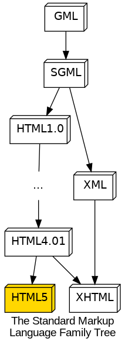

# The Hyper Text Markup Language

[[_TOC_]]

## What is HTML?

HTML (Hypertext Markup Language) is not a programming language.  If you want to think of HTML as source code, then the machine that uses it is a web browser. There are many programs besides web browsers which use HTML to describe the visual appearance of data (mail clients, smartphone apps, desktop apps), but in this class we focus on browsers.

The latest version of HTML is version 5. This is the version we will use for all purposes in this course.


## What does it mean for HTML to be HyperText?

The question "what's on the first page of the encyclopedia?" makes sense. An Encyclopedia is a volume of books containing articles that run in alphabetical order. The first page begins with the letter "A" and usually contains the article on Aardvarks. Likewise, the question "what's on the last page of the encyclopedia?" is sensible - in the 1911 edition of Britannica it is the article about "Zymotic Diseases".

What's on the first page of Wikipedia? We might consider this to be the search page. Now comes the trick question: what's on the last page of Wikipedia? This question is hard to answer because websites are not organized like books. Pages in books are arranged in order - page 1337 follows page 1336 and precedes 1338. Web pages are not arranged in a sequence. This kind of organization is the essence of "Hyper Text" - documents aren't stored in a contiguous, sequential collection and each word in a body of text can be *"linked"* to an *"anchor"* point in a different document (or even a point within the same document). The concepts of distance and sequence lose their importance in a hyper-connected document.

The concept of "links" and "anchors" is thus at the forefront of a Hypertext Markup Language (HTML) document.


## What does it mean for HTML to be a "markup" language?

Programming languages are for writing algorithmic instructions such that they can be evaluated mechanically.  A programming language can express the idea `take the sum of 1300 and 37 and store it in memory` in a way that a computer can carry out the operation.

HTML is not a programming language because it doesn't have the capability to describe computational operations.

A markup language describes the appearance of a rich document only using plain text.

Markup languages do not encode instructions for a CPU; rather they are used to annotate documents for human consumption.  Historically, markup languages have been used to encode visual information about a document in a medium which did not support directly representing its appearance. For example, before computers were able to display a rich document graphically as it was being edited, people were nevertheless able to create them on computers by authoring the corresponding markup language in a plain-text editor.

Markup languages describe the appearance of intricately structured multimedia documents in plain text.  
Segments of text that should have a special appearance are "marked" by special tokens that do not appear in the final document.  HTML calls its special tokens *tags*.  With tags you can mark

*   which words should be displayed in a larger or smaller font
*   where extra white space should be introduced or ignored
*   where an image, video clip or sound may be inserted

When the plain-text HTML document is *rendered* onto a graphical display it will not look like its source code, though with practice you will be able to correlate features of the rendered output with sections of the original source code.  If you *really* want to think of HTML as source code, then the "computer" that "runs" it is a web browser. However, HTML is used by more than just web browsers: email readers, smartphone and desktop apps rely on HTML   In this course we will focus on web browsers.

More recently HTML has been amended to encode structural information about a document in a way that is conducive to automation.  New HTML markup elements help text-to-speech screen readers and search engines locate the main story on a news site and ignore the navigation bar at the top and the legal disclaimer at the bottom.  This is a bit beyond the scope of this class, but you can search for "semantic web" if you want to learn more about this topic.

HTML is a member of an established family of markup languages started by IBM in 1969:



The peculiar aspects of HTML's syntax arise from its heritage.  The latest version of HTML is version 5, and this is the version we will use for all purposes in this course.


## HTML Main Ingredients

#### Tag
*   Special pieces of text which enclose or "wrap" other pieces of plain text
*   In HTML (and related markup languages such as XML and SGML) tags begin with the less-than symbol `<` and end with the greater-than symbol `>`
    *   E.g. `<html>`, `<head>`, `<div>`
*   Tags denote the type and extent of a markup element
*   There are three kinds of tags:
    1.  Opening tags contain a tag name and (optional) *attributes*:
        *   `<title>`, `<h1>`, `<strong>`, `<p class="col-lg-4">`, `<span style="font-weight: bold;">` are examples of opening tags
    2.  Closing tags have a front-slash `/` before the tag name:
        *   Closing tags *do not* have attributes
        *   `</title>`, `</h1>`, `</strong>`, `</p>`, `</span>` are examples of closing tags
    3.  Empty tags may or may not contain attributes and have a front-slash right before the greater-than symbol:
        *   `<br/>`, `` and `<meta charset="utf-8"/>` are empty tags


#### Content
*   Can be plain text
*   Or other HTML elements...
    *   ...which can contain other elements, and so on
    *   ```
        <title>The title of this webpage</title>
        <div>
            <p>'p' elements contain text content and other elements which modify text</p>
            <p>The 'strong' element makes <strong>text bold</strong></p>
            <p>The 'em' element makes <em>text appear in italics</em> for emphasis</p>
            <p>'img' elements do not contain content, and therefore need no "closing" tag</p>
        </div>
        ```
*   Every element has its own rules about which kind of content it can contain.  For example:
    *   It is incorrect to use an `li` element anywhere but within a `ol` or `ul` element
    *   `title` must be a child of `head`, which must be a child of `html`
    *   A document many only have a single `html` element, which *must* be the root of the document (e.g. it has no parent)


#### Attribute
*   Extra information about an element which is not part of its content
    *   The empty image element `img` uses the `src` attribute to encode the source of an image
*   In HTML (and related markup languages) attributes are key-value pairs of the form `key="value"` which appear within the opening tag after the tag's name, and before the `>` symbol
*   Values are *optional* on boolean attributes
    *   The mere presence of a boolean attribute is enough to activate its effect
*   Attribute values may be quoted with double `"` or single `'` quotes
    *   Values containing spaces *must* be quoted
    *   Best practice is to *always* use quotes
*   Attributes in HTML look like this:
    *   `href="https://duckduckgo.com"`
    *   `src="anchor.jpg"`
    *   `style="1px solid black"`
    *   `class="document-title"`
    *   `disabled`


#### Element
*   A pair of opening/closing tags, their attributes and content make an *element*
    *   For example, `<p class="col-md-4">This is an element, complete with tags which wrap its plain text content</p>`
*   Some elements are *empty* and do not need a closing tag
    *   Again, `<br/>`, `` and `<meta charset="utf-8"/>` are examples of empty tags
    *   Empty elements have no content besides their attributes
    *   Empty elements are leaf nodes on the HTML document tree
    

### An example of an HTML element containing other elements:

```
<div id="the-div" class="stuff-box red shadowed">
    <p>div elements may contain paragraphs and lists, among other things</p>
    <ol>
        <li>This is the 1st element of an ordered list</li>
        <li>This is the 2nd element of an ordered list</li>
    </ol>
</div>
```


## Writing your first HTML document

You don't need a special program to write HTML; a simple text editor is enough to get started.  After you save the file you can drag-and-drop it onto a browser window to view it.  Let's write a new webpage from scratch to try these elements out:

*   `title`
*   `h1`
*   `h2`
*   `p`
*   `em`
*   `strong`
*   `ol`
*   `ul`
*   `li`


### Practice

*   Follow along by re-creating this document on your own computer
*   Locate the file on your computer and open it in your browser


### Experimentation and making mistakes

I encourage you to experiment on this file on your own to get comfortable with HTML's syntax.  There are many ways to make mistakes in HTML, but the stakes aren't very high.  You *(probably)* can't crash your computer by writing bad markup, so there is nothing to be afraid of.  A great way to learn is to experiment and make a mess.  For better or worse, the browser is much more forgiving than a programming language compiler!  

Let's look at a few ways to get into HTML trouble:

*   Remove `/` from `title`'s closing tag
*   remove `title`'s closing tag entirely
*   Mismatched tags: open an `h1` and close with `/h2`
*   The non-existent `h0` tag
*   Mis-balanced `em` and `strong` tags
*   `li` tags used outside of lists


### Practice

*   Follow along with the me and make the same mistakes I do in your own document
    *   Can you cause a problem that the browser will report in an error message?
*   Find some new mistakes to make your very own 
    *   Pay attention to what happens in the browser when you do
    *   How will you recognize these mistakes the next time you make then
*   Try these same things in a *different* browser.  Today there are 2 major families of browsers:
    *   **Gecko** is the rendering engine used by Firefox
    *   **Blink** is the rendering engine of Chrome-based browsers (e.g. Google Chrome, Opera, Brave, Edge)
        *   Safari runs the **WebKit** rendering engine, which is the foundation of the **Blink** engine
    *   If you are using Firefox, try a **Blink**-based browser, and vice versa


## Images

Now add an image to this page using the `img` element. `img` is an *empty* element and needs attributes to be properly displayed.  Save this picture in a file named `Anchor.jpg` to follow along with me:

 

A larger version of this picture is found at `https://pixy.org/src/159/thumbs350/1594509.jpg`

### Practice

*   Add the anchor image to your document
    *   Download the image and link to your own computer
    *   Link to the image on the internet


## HTML is actually very simple

HTML is a very simple text format which doesn't require any fancy software to create.
Learning to write HTML is essentially an exercise in learning three concepts:

0.  What elements are recognized by the browser
1.  How they are composed
2.  Which attributes they can take


### All of your HTML questions can be answered on the *Mozilla Devloper Network* or MDN.

As you are well aware, internet technology moves fast. Today's innovation quickly becomes obsolete tomorrow. This poses a unique challenge for this course because every textbook I have considered adopting is outdated as soon as it is published. Instead, I rely on the online resource trusted by all of the professional web developers whose opinions I respect. The Mozilla Developer Network is well-regarded and authoritative.

[MDN web docs](https://developer.mozilla.org/en-US/)

I trust the MDN above sites like Stack Overflow and W3Schools to answer my questions about the web.  If you have a question, don't be surprised if my response is "what does the MDN say about that?"

**You are expected to study MDN documentation as part of this module's assignment!**

Consider the MDN, along with these online notes, to be your textbook for this course. 

*   [Getting started with HTML](https://developer.mozilla.org/en-US/docs/Learn/HTML/Introduction_to_HTML/Getting_started)
*   [HTML elements reference](https://developer.mozilla.org/en-US/docs/Web/HTML/Element)
*   [HTML attribute reference](https://developer.mozilla.org/en-US/docs/Web/HTML/Attributes)


#### What is the W3C?

Perhaps the only resource more authoritative than the MDN are the technology specifications published by the World Wide Web Consortium (W3C) itself.

> The World Wide Web Consortium (W3C) is an international community where Member organizations, a full-time staff, and the public work together to develop Web standards. Led by Web inventor and Director Tim Berners-Lee and CEO Jeffrey Jaffe, W3C's mission is to lead the Web to its full potential.

[About W3C](https://www.w3.org/Consortium/)

W3C documents are perhaps most useful for the people who *create* web technologies such as browsers and protocols.  W3C documentation is very precise, but less approachable than the MDN's.  But when you want to win an online debate in pedantic fashion, you can appeal to no higher authority.


### Practice

*   Visit the MDN and set a bookmark there (trust me, you'll come here often)
*   Locate the section titled "Learn web development"
    *   Explore the topics in the left sidebar
    *   Use these guides as needed to supplement what I teach you in this course


## HTML Minor Ingredients

There are just a few other pieces of syntax that you'll need to know, though
only one of these is required for a complete and correct HTML document.


#### DOCTYPE declaration

**The DOCTYPE declaration is *required* in HTML5, and is a *required* part of Assignment 0**

The first piece of text that appears in a **complete** and **correct** HTML document looks like a tag whose name starts with `!`:

	<!DOCTYPE html>

This is the "doctype declaration" which informs the browser what version of HTML the document purports to be.  It is not an element, and isn't really a part of the document.  It is information about the document, a.k.a. "metadata".  This is one of two "tags" in modern HTML which begin with the sequence `<` `!`.  Declarations like this are very prominent in SGML documents, less so in XML, and are basically a vestigal appendage in modern HTML.

The above doctype declaration identifies a document as HTML version 5.  I don't know why they left off the '5' nor what they'll do when HTML version 6 arrives.  Just be grateful that we no longer need to write doctype declarations like these:

	<!DOCTYPE html PUBLIC "-//W3C//DTD HTML 3.2 Final//EN">

    <!DOCTYPE HTML PUBLIC "-//W3C//DTD HTML 4.01 Frameset//EN" "http://www.w3.org/TR/html4/frameset.dtd">

If you omit the HTML doctype declaration the browser may interpret your document as an earlier version of HTML.  This will cause it to regard new HTML5 elements as *unknown*, resulting in a document that doesn't look quite right.


#### Comments

Comments in HTML are delimited by two tokens

```
<!-- -->
```

*	Text between these tokens are ignored by the browser
*	You cannot put comments just anywhere you want
	*	Comments cannot appear inside of a tag.  This example is **WRONG**:
		```
		<div <!-- class="note" -->  class="overview">Don't do this</div>
		```
	*	HTML comments cannot contain other comments
		*	In other words, you cannot nest HTML comments
	*	See the [HTML spec](https://html.spec.whatwg.org/#comments) for all of the rules and limitations.


#### Character Entities

The symbols `<` and `>` are significant in HTML because they form the boundaries of tags.  You've no doubt read webpages about mathematical relations such as $`a < b`$.  Since the symbol `<` begins a new tag, why isn't that treated by the browser as a syntax error?

What would you do if you needed to write a document that displays those symbols verbatim?  For instance, suppose you want to make a webpage that explains how to write HTML.  Your page would need to show HTML tags *without* those tags becoming a part of the page.

What is needed is a way to "escape" special HTML symbols.  *Character entities* are HTML's version of escape sequences.

*   In Java and Python backslash `\` is used as an *escape* character, allowing one to write "\n" to represent a newline character, or "\t" to represent a tab character.
*   Like other things in HTML, you must surround an escaped entity with the right characters at the beginning *and* the end
    *   So you get an extra opportunity to mess up 
    *   Entities begin with an **apostrophe** `&` and end with a **semicolon** `;`.  In between is a word or abbreviation indicating which single character the whole sequence stands for.
*   Some entities which you may have seen before include:
    *   `&gt;` represents the greater-than sign `>`
    *   `&lt;` represents the less-than sign `<`
    *   `&times;` for a multiplication symbol that's different from the letter `x`
    *   `&nbsp;` is the non-breaking space; a space character which a `p` won't eat
    *   `&amp;` the ampersand itself
    *   `&quot;` the literal double-quote mark
*   Emoji :poop: can be put into a document if you know its Unicode codepoint
    *   Follow this format: `&#1f4a9;`

The `&lt;` and `&gt;` entities are what allow you to write algebraic relations without confusing the browser's HTML parser.  They can be used to embed snippets of HTML source code into a webpage without the browser rendering it.

Entities aren't pretty, but they work!


* [MDN Glossary: Entity](https://developer.mozilla.org/en-US/docs/Glossary/Entity)
* [Official list of HTML character entities](https://html.spec.whatwg.org/multipage/named-characters.html#named-character-references)


### Practice

*   Add the HTML5 `DOCTYPE` declaration to your page
*   Add one or more comments
*   Use `&nbsp;` to add non-breaking spaces within paragraphs
*   Use `&lt;` and `&gt;` to put brackets around the names of tags
*   Add an [emoji](https://unicode.org/emoji/charts/full-emoji-list.html) to your page


## What form must a complete and correct HTML5 document have?

Although webpages may differ from each other, there is a basic structure which they must all follow in order to be correct.

    <!DOCTYPE html>
    <html lang="en">
        <head>
            <meta charset="utf-8">
            <title>The minimal, valid HTML5 document</title>
        </head>
        <body>
            <!-- This is an HTML comment -->
            <!-- User-visible content goes in the body -->
        </body>
    </html>


### Practice

*   Wrap your web page in this HTML template
*	When you refresh the page can you see any difference in the browser's rendering?


## Validating HTML using W3C's online tool

Your browser will silently fix any problems it comes across so that users have a pleasant experience.  This is frustrating for developers because it means that many errors are hidden from us by the "helpful" browser.

Since the browser is not very helpful when it comes to detecting HTML errors (read: actively conceals the truth), we must turn to another tool for this sort of insight.

One of the requirements of the next assignment is that your submission adheres the HTML5 standard as judged by the W3C Markup Validation Service.  This tool will help you find trouble spots in your documents.  The W3C has two versions of this tool; in this course we will use the [**Nu Html Checker**](https://validator.w3.org/nu/)


### Practice

*   Validate your page on the Nu W3C validator
