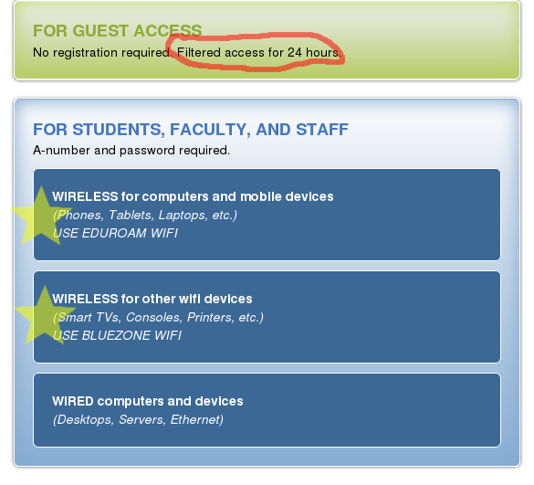

CS2610 - Monday, August 29 - Lecture 01 - Module 0

# Topics:
* [Announcements](#announcements)
* [Get to know your professor](#get-to-know-your-professor)
* [Get to know the course](#get-to-know-the-course)
* [Software Development Plan](#software-development-plan)
* [Action Items](#action-items)

------------------------------------------------------------
# Announcements

## Free Software and Linux Club

*   **What**  Welcome Back, Aggies!
*   **When**  6:00pm Wednesday, August 31
*   **Where** ESLC 053, [FSLC Discord server](https://discord.gg/p4jRxrQmqP)

Welcome back Aggies! Happy Syllabus Day!

This Wednesday will be catching up from the summer and planning our 
**Welcome / Intro to Linux** meeting next week.

Hop on our Discord and let us know you're coming so we can get a headcount.

# Get to know your professor

Hi, I'm Erik Falor, and I'm your professor this semester.

I graduated with a Master's degree from USU in Fall 2016 and have been teaching
here ever since.  Before that I worked as a software engineer for 13 years at
Spillman Technologies, Inc. (now Motorola Solutions) and Automated Products
Group.

Things I don't like

0. Counting from `1`
1. Microsoft Windows™
2. Desktop Environments
3. Office Suites with their pretentious "rich" file formats
4. Your text editor
5. Squishy keyboards
6. QWERTY
7. Mainstream music
8. Marvel Movies
9. Emoji :confounded: :nauseated_face: :put_litter_in_its_place:

Things I do like

0. Counting from `0`
1. Linux
2. Tiling window managers
3. OG plain-text files, Markdown, and $`\LaTeX`$
4. Vim
5. Mechanical keyboards
6. Colehack - my own custom keyboard layout
7. Lately I've been on a post-hardcore kick
8. One Punch Man
9. Emoticons `:-D`

There is no such thing as a "stupid question" in my classroom

(though some questions are not germane to the lecture)

# Get to know the course

*   Course structure
    *   [Topics covered in this course](../../Outline_of_Topics.md)
    *   These on-line lecture notes are your textbook
        -   https://gitlab.cs.usu.edu/erik.falor/fa22-cs2610-lecturenotes
    *   Content and assignments are organized into Modules on Canvas
    *   Complete the Course Contract ASAP
*   Assignments (80% of your grade)
    *   You have approx. 2 weeks per assignment
        -   This is *not* an invitation to procrastinate. Make every day count!
        -   A filled-out Software Development Plan is a **required part of each assignment**
        -   Don't write any code at the beginning - make sure you first understand what the assignment is about
    *   You *may* design & brainstorm with study buddies
    *   You *must* write your code individually
    *   Submit to GitLab only; nothing to do on Canvas
        -   The exception is the final assignment
    *   Within 72 hours complete the **Assignment Reflection Quiz** for 5 points
* Quizzes (10% of your grade)
    *   Two kinds - **Practice Quizzes** and **Mastery Quizzes**
    *   Practice quizzes
        *   Prime you to learn new things at the beginning of the module
        *   Help you to prepare for the graded quizzes
        *   Take as many times as you like
        *   **Do not** affect your grade
    *   Mastery quizzes
        *   Basic Canvas Quizzes
        *   No Proctorio; please don't be the one who forces me to start using it
        *   Test your mastery of concepts taught in the module
        *   Due at the end of the module
        *   **Do** affect your grade
        *   May be taken **only one time**
* Class participation (10% of your grade)
    *   Meet your study buddies and form your network of software colleagues
    *   50 points for in-class participation
    *   50 points for being the Designated Questioner one time
        *   You can get ponits for on-line discussions on Canvas
        *   If you have a special circumstance, Designated Questioner can be done on-line as well (ask me)
*   Course Discord Server
    *   Participation on Discord is **optional**.
    *   [Discord Invite](https://discord.gg/XUe2cqBQ)
*   CS Coaching Center
    *   Location: [Online](https://coach.cs.usu.edu) (for now, at least)
    *   Hours
        *	Mon - Fri: 9am to 9pm
        *	Saturday: 12pm to 8pm
    *   The coaches aren't there to write your code for you, they support you in doing the work yourself!
    *   You must present a completed *Software Development Plan* before they will answer questions about your code.  This document is already *required* in this course, and it is necessary if you want their help.  The TAs and I will also ask for your plan when you come to us for help about assignments.
    *   Coaches don't help you study for exams.  Do that with your study buddies.
*   My Office Hours
    *   IRL: Old Main room 418A
    *   Virtually:  https://usu-edu.zoom.us/my/erik.falor?pwd=ZE4zNXRpNVl4VVhHNkN5Q2wwV3VrUT09
    *   When: Thursday 9am to 12pm
*	Teaching Assistants
	*	Taylor Anderson
	* 	Aashish Ghimire
	*	Shain Shahid Chowdhury Oni
	*	Check the Syllabus for their up-to-date office hours and contact info

# [Software Development Plan](../../Software_Development_Plan.md)

*   This will be a required part of every assignment in which you write code
    *   It is not required for Assignment 6 **Hack the Planet!**, because that assignment has no code
*   Although the above template is a Markdown file, you will submit your Plan as an HTML file
    *   This is a web development course, after all!
*   Plan on spending 50% of your time *designing* your solution before writing any code
    *   Don't write your plan *after* writing your code
    *   You're doing it wrong
    *   I can totally tell that's what you did

# Action Items

## Before our next lecture on **Wednesday**:

0.  Complete the Course Contract quiz on Canvas
1.  Make your account on https://gitlab.cs.usu.edu
    *   Follow the instructions in [How To Submit Assignments](../../How_To_Submit_Assignments.md)
    *   While on campus you must connect using the **Eduroam** network
    *   You cannot see my GitLab server while on **BLUEZONE** 
    *   
2.  Run through the Required Software Install Instructions on Canvas so we can address any issues ASAP
3.  If you are intimidated by command line interfaces, don't sweat it!  You are in good company; nobody can use these things at first!  I have prepared some resources to help you catch up:
    *   [Unix command line basics](../../Unix_CLI.md)
    *   The interactive [Shell Tutor](https://gitlab.cs.usu.edu/erik.falor/shell-tutor)

