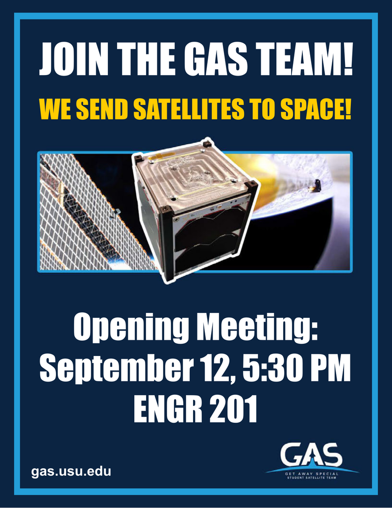
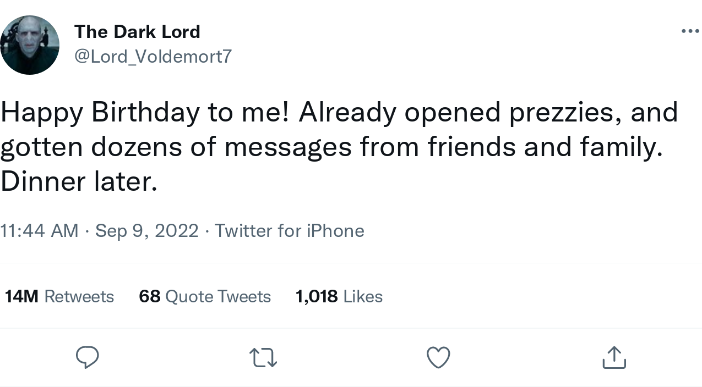

CS2610 - Friday, September 09 - Lecture 05 - Module 0

# Topics:
* [Announcements](#announcements)
* [Mud card activities](#mud-card-activities)
* [The Browser's Developer Tools](#the-browsers-developer-tools)
* [Cascading Style Sheets](#cascading-style-sheets)
* [What happens when many CSS rules apply to the same element?](#what-happens-when-many-css-rules-apply-to-the-same-element)

------------------------------------------------------------
# Announcements

## Assignments #0 and #1 due dates pushed back

*   Assignment #0 is now due next **Wednesday, September 14th**
*   Assignment #1 is now due **Wednesday, September 28th**
*   The due date of Assignment #2 **remains unchanged**
    *   You still get 2.5 weeks for that assignment, up from the usual 2.0 weeks.

## Get Away Special (GAS) 

*   **What**  Opening Meeting
*   **When**  5:30pm Monday, September 12th
*   **Where** ENGR 201

[GAS is an undergraduate team sending student projects to space since 1976](https://gas.usu.edu)

The Get Away Special Team is an **undergraduate**, **extracurricular research team** within the Utah State University Physics Department that gives students the opportunity to learn real-world engineering skills by effectively contributing to aerospace research.  We are fueled by the passion of our team to design, develop, test, and produce something that will advance space technology.  We take pride in producing individuals who are prepared to enter the workforce or continue in academia as innovative and cooperative members or leaders of their teams.

## CyberSentinel Opening Social (in association with AIS)

* **When:**  Wednesday, September 14 at 7:00 p.m.
* **Where:** Huntsman Hall first floor area
* **What:**  Pizza, drinks, dessert, fruit, Flamin' Hot Cheetos, info session

Do you dream of the day when you can finally break into an enemy system (wearing a black hoodie in a dark room somewhere) and dramatically say "I'm in."? Have you ever wanted to learn how to (ethically) crack passwords, steal credentials (that are yours), break into websites (with permission), hide sensitive info in cat pics (why not), or write your own malware? (for legal reasons, that's a joke)

If so, come check out CyberSentinels! Even if none of those things sound interesting to you yet, come for the food then stay for the hacking! For more info, join our [Discord server](https://discord.gg/YbB9zuD7f6)

# Action Items

## Call on 2 designated questioners

# Mud card activities

Today I will ask you to turn in a "mud card" at the end of class.

The name comes from "muddiest point".  As you listen to the lecture you will
likely encounter something that you'd like to go deeper on, either because I
explained it poorly, or you are just curious.

Mud cards serve the following purposes:

0. Provides me a quick head-count of who attended today
1. Putting your thoughts into writing improves your ability to recall them later
2. Lets me know which topics were well received, and which need another approach
3. Gives you another way to ask a question in a non-intimidating way

Please **legibly** write your name and A-number at the top.  I'll give you 5 participation points for just turning that in.

If you have questions, comments or doodles, please jot them down.  I'll do my best to respond to as many as time allows.

# [The Browser's Developer Tools](../Browser_Developer_Tools.md)

Your browser has developer tools offer ways to debug your HTML and CSS, as well
as ways to explore the HTTP Protocol.  Let's take a more detailed look at the
tools your browser has to offer.

## Protip: never trust screenshots

The Dark Lord's [original tweet](https://twitter.com/Lord_Voldemort7/status/1093696565892562946)

This is a totally legit screenshot you guise:

# [Cascading Style Sheets](../CSS.md)

We have discussed how HTML uses *tags* to encode two types of information:

0.  The structure of a document
1.  The appearance of a document

Relying solely on the structure of the markup document inhibits the
maintainability within a single page as well as across many pages.

The problem that CSS solves is that the *appearance* of a document shouldn't
depend entirely upon its *structure*.

## Assignment #0 Required CSS

Use each of the following CSS properties at least once in this assignment:

*   `background-color`
*   `color`
*   `font-family`
*   `font-style`
*   `font-size`
*   `margin`
*   `padding`

Use each of these CSS selectors at least once in this assignment:

*   `element`
*   `.class`
*   `#id`
*   `:nth-child`

# [What happens when many CSS rules apply to the same element?](../CSS.md#what-happens-when-many-css-rules-apply-to-the-same-element)

CSS is named for "the cascade algorithm" which dictates the order in which
contradicting styles are applied

The cascade algorithm applies rules in order according to this hierarchy:

0.  **Importance**
1.  **Specificity**
2.  **Source order in the CSS file**

