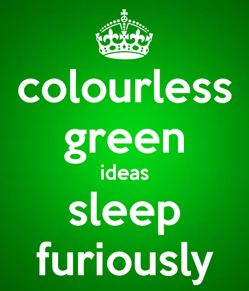

# The HyperText Transfer Protocol


## Table of Contents

*   [What is a Protocol?](#what-is-a-protocol)
*   [Syntax vs. Semantics](#syntax-vs-semantics)
*   [The syntax of HTTP messages](#the-syntax-of-http-messages)
*   [HTTP Semantics](#http-semantics)
*   [HTTP Methods](#http-methods)
*   [HTTP Response Status Codes](#http-response-status-codes)
*   [HTTP Headers](#http-headers)


## What is a Protocol?

#### Protocol
A system of rules defining how data is exchanged between systems and how the data is formed.

#### Hyper Text Transfer Protocol (HTTP)

*	A network protocol originally invented by Tim Berners-Lee at CERN in the early 90's to share information between researchers.
*	HTTP was designed to be a good fit for HTML, but it is widely used to transfer other kinds of data

As far as protocols go, HTTP is **very simple**

*   HTTP defines communication between *user-agents* (a.k.a. clients) and *servers*
    *   This is the opposite of a *peer-to-peer* protocol; there is a clear delineation between user-agents and servers
    *   A *user-agent* is a piece of software that acts on behalf of a user.
        *   Web browsers are the most common user-agent, but can include email clients, mobile devices, Internet of Things devices, etc.
    *   A user-agent *always* acts as a user-agent and never changes its role
    *   A server *always* acts as a server and never changes its role
    *   User-agents *always* initiate communication
    *   Servers *only* respond to user-agents and *never* initiate communication
    *   A communication consists of a *single* request followed by a *single* response
*   The flow of an HTTP conversation always follows this pattern:
    0.	An HTTP user-agent initiates a communication by sending an HTTP *request* to a server
    1.	The server replies with a *response*, concluding the communication
*	HTTP is expressed as human-readable *plain text* as opposed to binary
	*	This is a feature it enjoys by sitting at the top of the protocol hierarchy
*	HTTP isn't comprehensive, and leaves many details to the other protocols it sits on top of
	*	Domain name to IP address resolution is left to DNS (the Domain Name System)
	*	Connection negotiation and maintenance, which is handled by TCP/IP (Transmission Control Protocol/Internet Protocol)
*	HTTP is extensible through a wide variety of *headers*
    *   Headers typically convey information about the request itself, a.k.a. *meta-data*
	*	Headers work when user-agents (web browsers, mostly) and servers agree upon what a particular header means
	*	When an unrecognized header is present in a message, the receiver (either a user-agent or a server) simply ignores it instead of raising an error
	*	This agreement to silently ignore errors makes it easy to add new features to the protocol later
		*	Similiar to how HTML errors are ignored by the browser, this can make debugging frustrating!

### Further reading

https://developer.mozilla.org/en-US/docs/Web/HTTP/Overview


## Syntax vs. Semantics

A protocol is essentially a language.  When picking up a new language there are only 2 things you need to learn

0.  **Syntax** - the *form* of the language
    *   What symbols is the language comprised of?
    *   What order may I arrange the symbols of the language?
1.  **Semantics** - the *meaning* of the language
    *   What meaning do these symbols have when arranged this way?
    *   Is this particular ordering of symbols nonsense?

There are thus two kinds of errors:

0.	A **syntax** error happens when a language token is spelled wrong or when punctuation is used incorrectly
	*	Examples of syntax errors in HTML include
		*	Omitting `/>` from an empty tag like `img`
		*	Leaving off an element's closing tag
		*	Mixing a double-quote and a single-quote in an attribute
1.	An error in **semantics** occurs when the structure of the communication is incorrect
	*	Examples in HTML include
		*	Writing `https://media.giphy.com/media/mq5y2jHRCAqMo/giphy.gif</img>` instead of using the `src` attribute
		*	Putting `<title>` somewhere besides the `<head>`
		*	Writing an `<li>` that is not a direct child of either `<ol>` or `<ul>`

A syntax error *usually* implies a semantic error.  However, an error of semantics can occur in an otherwise correct document.  This phrase in English is valid **syntactically** but not **semantically**:



Despite the lack of syntax and grammatical errors, it doesn't make any sense.

In any case, browsers tend to be very forgiving with HTTP errors of both kinds.  If it can't *fix* the error, it will silently ignore those portions that it can't make sense of.  This results in webpages that are subtly wrong.  *If* you happen to notice that something is wrong, you've got your work cut out for you to find out why.


## The syntax of HTTP messages

### HTTP requests have this form:

0.	Start with a *request line*, stating
	*	The HTTP method (or verb)
	*	The path of the request
	*	The version of the HTTP protocol the client can understand
1.	**Optional** one or more *header* lines
	*	Header lines start with the name of a header
		*	Header names have no spaces and use `-` to separate words
		*	Capitalization does not matter
	*	Next comes a colon `:`
	*	Followed by a value
		*	Values may contain spaces but **not** newlines
		*	Values can be very, very long
2.	Followed by a blank line
3.	**Optional** textual or binary content

All put together it looks like this:

```
METHOD PATH VERSION
Header0: value0 (optional)
Header1: value1 (optional)
...
<blank line>
Optional content data follows...
```


### HTTP responses have this form:

0.	Begin with a *response* line which states
	*	The HTTP version of the reply
	*	A three digit status code indicating the disposition of the message
	*	A human-readable description of the status code
1.	**Optional** one or more *header* lines, which follow the same rules as requests
2.	Followed by a blank line
3.	**Optional** textual or binary content

Responses look similar to requests:

```
VERSION STATUS_CODE STATUS_MESSAGE
Header0: value0 (optional)
Header1: value1 (optional)
...
<blank line>
Optional content data follows...
```

### A real HTTP conversation might go like this:

#### Request

```http
GET /bio HTTP/1.1
Host: localhost:8000
User-Agent: Mozilla/5.0 (X11; Linux x86_64; rv:68.0) Gecko/20100101 Firefox/68.0
Accept: text/html,application/xhtml+xml,application/xml;q=0.9,*/*;q=0.8
Accept-Language: en-US,en;q=0.5
Accept-Encoding: gzip, deflate
Connection: keep-alive
Upgrade-Insecure-Requests: 1
Pragma: no-cache
Cache-Control: no-cache
```

#### Response

```http
HTTP/1.0 301 Moved Permanently
Server: BaseHTTP/0.6 Python/3.7.4
Date: Sun, 13 Sep 2020 03:49:03 GMT
Connection: close
Cache-Control: max-age=6
Location: /about
```


### Further reading

*	https://developer.mozilla.org/en-US/docs/Web/HTTP/Messages


### Practice

*   Open a new browser tab
*   Activate the developer tools
*   Go to the 'Network' tab
*   Browse to a website that you frequent
*   Examine some of the requests generated by your visit


## HTTP Semantics

The meaning of the text sent by a user-agent depends upon which

*   the *version* of HTTP the user-agent is speaking
*   the *method* being used
*   which *path* the request is sent to
*   an optional data payload

The meaning of the text that the server replies with depends on

*   which *version* of HTTP that is spoken by the server
*   the *response status code* which communicates the disposition of the request
*   any data payload


## [HTTP Methods](https://developer.mozilla.org/en-US/docs/Web/HTTP/Methods)

HTTP Methods are the set of *verbs* in HTTP which define all possible actions that HTTP clients can perform with an HTTP server.

These are *some* of the most common verbs in the HTTP language:

#### [GET](https://developer.mozilla.org/en-US/docs/Web/HTTP/Methods/GET)
Requests a representation of the specified resource. Requests using GET should only retrieve data

**This is the only request type you're required to support in Assignment #1.**


#### [POST](https://developer.mozilla.org/en-US/docs/Web/HTTP/Methods/POST)
Submit an entity to the specified resource, often causing a change in state or side effects on the server


#### [PUT](https://developer.mozilla.org/en-US/docs/Web/HTTP/Methods/PUT)
Replaces all current representations of the target resource with the request payload


#### [DELETE](https://developer.mozilla.org/en-US/docs/Web/HTTP/Methods/DELETE)
Removes the specified resource


#### [HEAD](https://developer.mozilla.org/en-US/docs/Web/HTTP/Methods/HEAD)
Asks for a response identical to that of a GET request, but without the response body


#### [OPTIONS](https://developer.mozilla.org/en-US/docs/Web/HTTP/Methods/OPTIONS)
Asks the server what communication options it supports

*Interesting note: in 2017 OPTIONS responses from the Apache HTTP server were
found to contain unrelated information.  There was a risk that attackers could
gain access to sensitive informaation in this way.  Search for 'optionsbleed'
for more info.*

https://blog.fuzzing-project.org/60-optionsbleed-http-options-method-can-leak-apaches-server-memory.html


### Practice

*   Inspect the set of requests generated by your previous page visit in the developer tools
    *   What type of requests are the most common?
    *   Do you find any `HEAD` or `OPTIONS` requests in the mix?


## [HTTP Response Status Codes](https://developer.mozilla.org/en-US/docs/Web/HTTP/Status)

The server's response begins with a three-digit number indicating the
disposition of the client's request.  You've undoubtedly encountered a webpage
bearing the message `404 Not Found`.

Responses are grouped into five broad categories whose status codes share the
same first digit.  Response status codes are always accompanied by a
human-friendly translation.

| Category      | Digit | Examples                                                                      |
|---------------|-------|-------------------------------------------------------------------------------|
| Informational |  1xx  | `100 Continue`, `101 Switching Protocol`                                      |
| Success       |  2xx  | `200 OK`, `201 Created`, `204 No Content`                                     |
| Redirection   |  3xx  | `301 Moved Permanently`, `307 Temporary Redirect`                             |
| Client errors |  4xx  | `400 Bad Request`, `401 Unauthorized`, `403 Forbidden`, `404 Not Found`       |
| Server errors |  5xx  | `500 Internal Server Error`, `501 Not Implemented`, `503 Service Unavailable` |


### Practice

*   Examine one of the responses generated by your previous visit in the developer tools
    *   What type of status codes are the most common?
    *   Did you get any status codes in the `400` class?
*   Visit `https://google.com/teapot`
    *   What status code did Google respond with?


## [HTTP Headers](https://developer.mozilla.org/en-US/docs/Web/HTTP/Headers)

*   HTTP headers allow the client and the server to pass additional information with the request or the response.
*   A request header consists of its case-insensitive name followed by a colon ':', then by its value (without line breaks).
*   Leading white space before the value is ignored.

There are broad two categories of headers:

0.  **Request** headers are sent from client to server
1.  **Response** headers are sent from server to client

*General* headers may be included in both a **request** and a **response** (i.e. they can be sent in both directions).

Here are some important headers that let the client and server negotiate the
terms of communication:


### [Server](https://developer.mozilla.org/en-US/docs/Web/HTTP/Headers/Server)
The Server header contains information about the software used by the origin
server to handle the request.

Overly long and detailed Server values should be avoided as they potentially
reveal internal implementation details that might make it (slightly) easier for
attackers to find and exploit known security holes.

    Server: meinheld/0.6.1
    Server: Apache


### [Date](https://developer.mozilla.org/en-US/docs/Web/HTTP/Headers/Date)
The `Date` general HTTP header contains the date and time at which the message was originated.

    Date: Fri, 13 Sep 2019 03:37:59 GMT


### [Connection](https://developer.mozilla.org/en-US/docs/Web/HTTP/Headers/Connection)
The `Connection` general header controls whether or not the network connection
stays open after the current transaction finishes.

	Connection: keep-alive
	Connection: close


### [Cache-Control](https://developer.mozilla.org/en-US/docs/Web/HTTP/Headers/Cache-Control)

The `Cache-Control` general header field is used to specify directives for
caching mechanisms in both requests and responses.  `max-age` is expressed
in seconds.

	Cache-Control: no-cache
	Cache-Control: max-age=600


### [Content-Length](https://developer.mozilla.org/en-US/docs/Web/HTTP/Headers/Content-Length)
This general header indicates the size, in bytes, of the payload sent to the
recipient.  Non header-only responses from the server will use it to tell the
browser how much data to expect.

When used as a request header it is only meaningful when used in conjunction
with requests that send a payload of data.  These requests include POST, PUT,
and PATCH.  GET requests send only headers, hence this header isn't used then.

The content begins on the line immediately following the `\r\n` blank line
separating the headers from the payload in a POST request.

    Content-Length: 42
    Content-Length: 1337

*Question:* if GET requests don't tell the server how many bytes to expect, how
does the server know when it has received the entire request from the client?


### [Content-Type](https://developer.mozilla.org/en-US/docs/Web/HTTP/Headers/Content-Type)
The `Content-Type` general header is used to indicate the media type of the
resource.

In responses, a `Content-Type` header tells the client what the content type of
the returned content actually is.

In requests, (such as `POST` or `PUT`), the client tells the server what type
of data is actually sent.

    Content-Type: text/css
    Content-Type: text/html; charset=UTF-8
    Content-Type: text/plain
    Content-Type: application/octet-stream
    Content-Type: audio/mpeg
    Content-Type: audio/ogg
    Content-Type: image/jpeg
    Content-Type: image/png
    Content-Type: video/mpeg
    Content-Type: video/webm


### [Location](https://developer.mozilla.org/en-US/docs/Web/HTTP/Headers/Location)

The Location response header indicates the URL to redirect a page to.  It only
provides a meaning when served with a 3xx (redirection) or 201 (created) status
response.

Your Simple HTTP server will send this header back to a client under a few
circumstances, such as when a user visits a path starting with `/bio`.

    Location: /about


### [Accept](https://developer.mozilla.org/en-US/docs/Web/HTTP/Headers/Accept)
The `Accept` request HTTP header advertises which content types, expressed as
MIME types, the client is able to understand.  The last example tells the
server "I will accept all types of content".

	Accept: text/html, text/plain, application/octet-stream
	Accept: image/jpeg, image/png
	Accept: image/*
	Accept: */*


### [Accept-Encoding](https://developer.mozilla.org/en-US/docs/Web/HTTP/Headers/Accept-Encoding)
The `Accept-Encoding` request HTTP header advertises which content encoding,
usually a compression algorithm, the client is able to understand.  Multiple
algorithms are specified, in preference order, separated by commas.

    Accept-Encoding: gzip
    Accept-Encoding: deflate
    Accept-Encoding: br
    Accept-Encoding: gzip, compress, deflate, br
    Accept-Encoding: *


### [Cookie](https://developer.mozilla.org/en-US/docs/Web/HTTP/Headers/Cookie)
The `Cookie` HTTP request header contains stored HTTP cookies previously sent by
the server with the Set-Cookie header.

All cookies must be sent as one line of text, with no newline characters.  This
header takes a list of name=value pairs. Pairs in the list are separated by a
semi-colon and a space ('; ').

	Cookie: chocolate=chip; yummy=true;


### [Set-Cookie](https://developer.mozilla.org/en-US/docs/Web/HTTP/Headers/Set-Cookie)
The `Set-Cookie` HTTP response header is used to send cookies from the server to the user agent.  An expiration date for this cookie may be specified by the server.

	Set-Cookie: Hungry_For_Apples=no
	Set-Cookie: Whats_Up=My_Glip_Glops; Max-Age: 600
	Set-Cookie: South_Park=Already_Did_It; Expires: Wed, 02 Oct 2013 17:01:03 GMT;
	Set-Cookie: This_is=The_Way; Expires: Wed, 02 Oct 2013 17:01:03 GMT; Path=/shows/Mandalorian

*   The `Max-Age` directive is expressed in seconds
*   The `Expires` directive is a date **FROM THE POINT OF VIEW OF YOUR PC**!
*   The `Path` directive specifies a path that must exist in the requested URL, or the browser won't send the `Cookie` header.
    *   The forward slash `/` character is interpreted as a directory separator, and subdirectories will be matched as well: for `Path=/docs`, `/docs`, `/docs/Web/`, and `/docs/Web/HTTP` will all match.


### Practice

*   Examine one of the requests generated by a visit to your favorite website
    *   What response headers did your browser receive from the server?
    *   What request headers did your browser send?
*   How do you feel about the information that your browser sends out with each request?
    *   Are you surprised by how much is sent?
    *   Are you surprised by any specific details?
