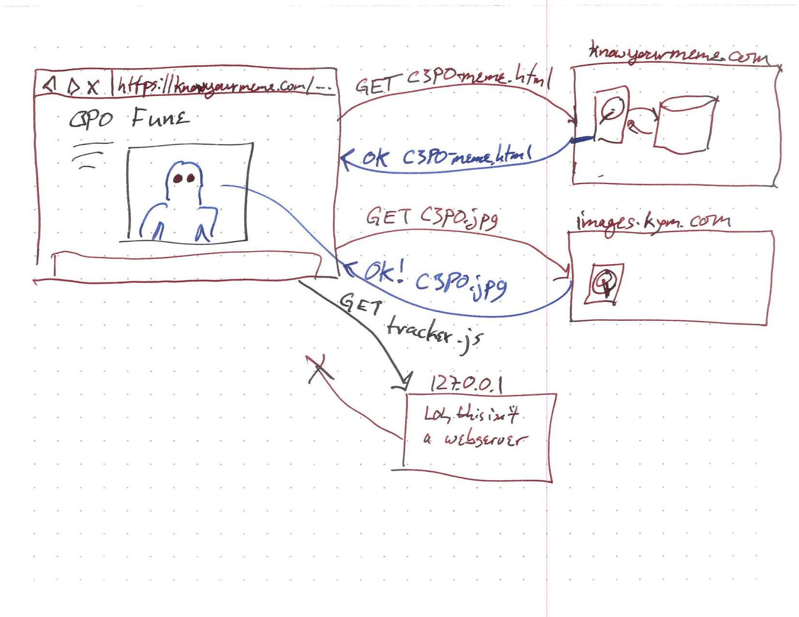

CS2610 - Wednesday, September 14 - Lecture 07 - Module 1

# Topics:
* [Announcements](#announcements)
* [Mud card followup](#mud-card-followup)
* [Assignment #1: Simple HTTP Server in Python](#assignment-1-simple-http-server-in-python)
* [How does a web server fit into the scheme of things](#how-does-a-web-server-fit-into-the-scheme-of-things)

------------------------------------------------------------
# Announcements

## Free Software and Linux Club

*   **What**  How to Install Linux
*   **When**  6:30pm Wednesday, September 14th
*   **Where** ESLC 053, [FSLC Discord server](https://discord.gg/p4jRxrQmqP)

We've now discussed why you'd want to use Linux. But what about the how?

Join us on the 14th of September at 6:30 in ESLC 053 to find what distro is best for you, get Linux installed in whatever manner you'd like (dual boot, VM, full throttle Linux-only partition, etc.), solve any pesky bugs pestering you and your lovely machine, or just chill!

# Action Items

*   Assignment 0 is due **tonight** at midnight
    *   Be sure to carefully follow the instructions in [How To Submit Assignments](../../How_To_Submit_Assignments.md)
*   Call on 2 designated questioners

# Mud card followup

I will update your participation scores at the same time we release grades for Assignment 0.

## HTML & CSS

> Do all child tags inherit all parent attributes?

*   Yes, unless the child tag overrides the parent's attribute.

> Do HTML and CSS get updated together?

*   They are continually being updated, but to my knowledge they are not updated in lock-step with each other.
    *   [HTML Living Standard](https://html.spec.whatwg.org/)
    *   [Cascading Style Sheets home page](https://www.w3.org/Style/CSS/)

> Which CSS selectors are used most by professional web developers?

*   I feel like `.class` selectors take up the most space in stylesheets.

> Is it good practice to use both an external stylesheet **and** `<style>` tags in the head of a document?

*   They serve different purposes, so I don't think it's bad to mix them.
*   However, if you find that the contents of your `<style>` tags are repeated across all of your webpages, you should consider rolling the common parts up into an external file

> Is it better practice to write the HTML first, then CSS, or the other way around?

*   Neither.  They evolve together, so write them at the same time!

> Is CSS less or more expensive in terms of space/data than using only HTML?

*   Less expensive because of the **DRY** principle
*   **DRY** = **D**on't **R**epeat **Y**ourself

> What should be in a single `
` tag?  One element?  One section?  Basically, how often and when should I use `
` tags?

*   There's a whole taxonomy of [Content sectioning](https://developer.mozilla.org/en-US/docs/Web/HTML/Element#content_sectioning) elements in the HTML5 spec.
    *   These elements let you describe the *organization* of the document in a way that makes sense to automated systems (e.g. screen readers, search engines, etc.)
*   The `
` is the [generic container for flow content](https://developer.mozilla.org/en-US/docs/Web/HTML/Element#text_content), and most often holds one child element.  Its main purpose is to take on a class attribute that influences how its child(ren) appear.

## Miscellaneous

> Is there any way to prevent people from getting into the raw text from an HTML, like if you're trying to keep a paywall up for a news site?

*   No
    *   In order to display their webpage on your device, they need to send you the HTML
    *   Once you download it, there's no way for them to stop you from inspecting it

> Can we use any "client" for our assignments?

*   Yes
*   But do test your webpages in both Firefox and a Chrome-based browser
    *   Pretty much everything that is **not** Firefox is Chrome-based

> If HTML is so limited w/o CSS, why aren't other markdown [sic] languages more mainstream?

*   I think HTML is popular **because** of CSS
*   It also helps that there are very featureful, open source HTML renderers available for people to add to their applications

## Linux / Cybersecurity

> For cybersecurity, is a general knowledge of Linux required?  Or, more generally, what languages/concepts should I get familiar with as a first step?

*   Knowing Linux is not required per se, but you are very limited if you don't know your way around a Linux system
    *   This is because something like 90% of all servers run Linux
    *   The best cybersecurity tools are made on/for Linux

> What is the main difference between the major Linux variants?

*   Linux variants are called "distributions"
*   They chiefly differ by
    *   How you install them
    *   What set of programs are installed by default
    *   How you keep your system up-to-date

> What is your favorite flavor of Linux?

*   My favorite distro is [Slackware Linux](http://www.slackware.com/)

> What is a good flavor of Linux for a n00b to start with?

*   Ubuntu or Mint because they have a very large userbase
*   Manjaro is pretty easy to get set up
*   `Pop!_OS` is quickly becoming popular
*   Slackware, Arch, and Gentoo are examples of Linux distros that target advanced users.
    *   If you are a n00b, installing one of these will be a frustrating, but character-building, experience
*   If you have questions about this, you should come to FSLC tonight at 6:30 ESLC 053!

> If a developer leaves a backdoor to a database, could you access that from the inspector and change the data in the database?  I'm just curious if you can permanently change data from the browser developer tools.

*   Yes, this is possible, even without a rogue developer intentionally leaving a backdoor in the server
    *   You might do this through JavaScript, or by making HTTP requests
    *   However, you cannot change something on the server using the Document Inspector tool
*   We will do this very thing in a later assignment

#   Assignment #1: Simple HTTP Server in Python

*   You should use the starter code found in the *Hints* section of the assignment on Canvas
*   This doesn't need to be a very long program
    *   My implementation is only 105 SLoC, much of which are string literals containing hard-coded HTML pages
*   One of the skills this assignment exercises is *reading documentation*
    *   You won't find many hand-holding tutorials about writing a web server in Python online
    *   All of the functionality you need is described in the assignment description and in the official Python documentation

## Assignment objectives

*   Gain experience in reading technical software documentation
*   Learn how the Hyper Text Transfer Protocol is used by servers and browsers to facilitate communication
    *   Interpret HTTP requests and form valid responses
    *   Use HTTP status codes to control the browser
    *   Redirect requests to different resources
    *   Send custom response headers
*   Serve HTML, CSS and image files to clients
    *   Use MIME types to help the browser properly display resources
*   Serve dynamically-generated pages
*   Gracefully handle client errors

## Getting Started:

0.  The #0 thing you can do is to carefully read the assignment description
    *   don't worry if it doesn't make sense this time
    *   your goal is to get a sense of the scope of the project
1.  The #1 thing you can do is to read the documentation of Python's `http.server` library
    *   don't worry if it doesn't make sense this time
    *   you're just becoming familiar with the ingredients

## Demo

The finished product will look a little something like this...

*Demonstrate my implementation*

There is a video on the Canvas page that you can refer back to.

# How does a web server fit into the scheme of things?

This is the story of how a meme leaves the land of the cloud and makes the
magical journey to your computer.

You may be shocked to learn just how many web servers are involved when you
look at a picture online:

* https://knowyourmeme.com/photos/1554007-red-eyed-c-3po

## Diagram of the KYM interaction:

## TL;DR

By using the developer tools you can reveal all of the creepers following you around the web.  You may think that you are visiting one website, but in reality *many* sites are visiting your computer.

