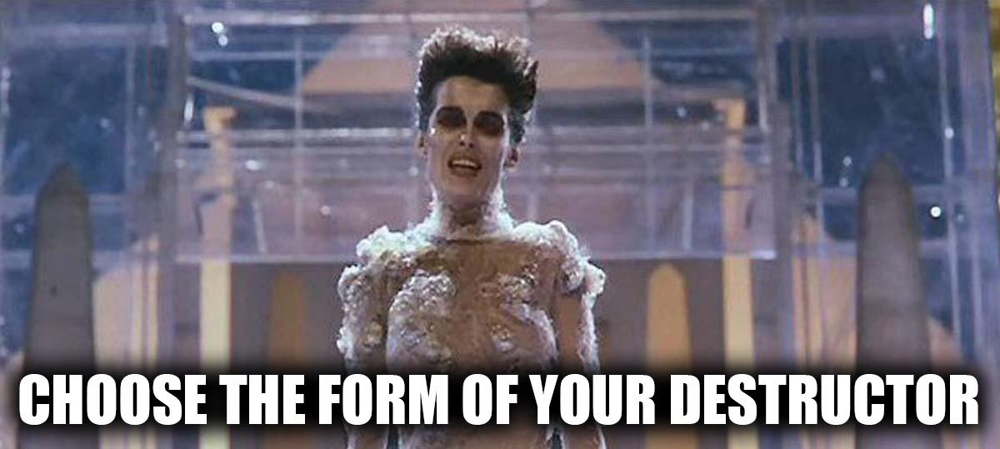
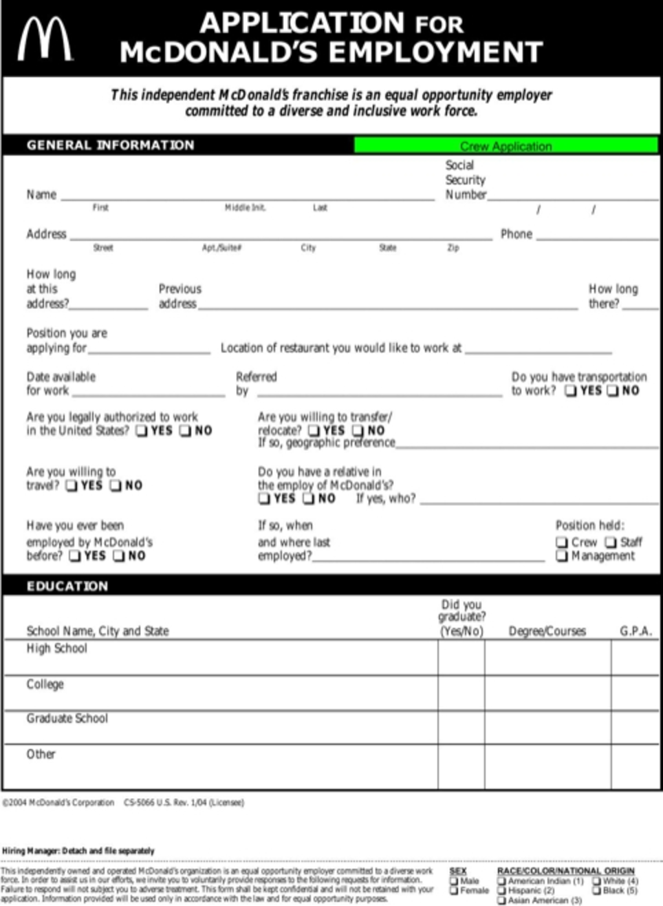

# Sending data to servers with HTML Forms

*   [What is an HTML Form?](#what-is-an-html-form)
*   [HTML Form syntax](#html-form-syntax)
*   [Form input elements](#form-input-elements)


## What is an HTML Form?

<details>

<summary>Think about what "form" means</summary>



</details>


No, not that kind of form!


<details>

<summary> Something more like this: </summary>



</details>


The webpages we've used so far represent one-way communication from server to
client.  HTML Forms enable us to talk back to webservers.  Information is
collected by the browser much as when filling in blanks on a paper form.  The
filled-in form is then sent by the browser to the server in an HTTP request.

* `<form>` is an HTML element on a webpage
* A form contains `<input>` child elements to collect user input
* The form describes *where* to send the user's input and *which type* of HTTP
  request to use to get it there

## Further Reading

*   https://developer.mozilla.org/en-US/docs/Web/HTML/Element/form
*   https://developer.mozilla.org/en-US/docs/Learn/HTML/Forms/Your_first_HTML_form
*   https://developer.mozilla.org/en-US/docs/Learn/Forms/Sending_and_retrieving_form_data


## HTML Form syntax

To create a form section, we provide the form with a name, id, action, and
method. An example with blank attributes looks like this:

    <form action="" method="">

        <!-- labels, buttons, sliders, text boxes, etc. go in here :) -->

    </form>


A filled-in example is this:

    <form action="https://duckduckgo.com/" method="GET">
        <div>
            <label for="ddg-search">Search Term</label>
            <input id="ddg-search" name="q" type="search" placeholder="Enter your search term" />
            <button id="submission" type="submit"> Search on DuckDuckGo </button>
        </div>
    </form>


### HTML Form element Attributes

At minimum a `<form>` needs to know *where* to go and *how* to get there.  This
information is encoded into attributes of the `<form>`.

* `action` - The URL your browser sends the user upon `<form>` submission.
  This may be an absolute or a relative URL.  If you leave this attribute off,
  the browser defaults to the URL of the page you're on.
* `method` - Which HTTP request to send the user's carefully entered data to
  the server.  Any HTTP request type is acceptable here, for example this
  attribute's value may be `GET`, `POST`, `PUT`, or `DELETE`.  If you leave
  this off your browser defaults to `GET`.


Right now, the only HTTP method we've used is `GET`, which causes the browser
to encode the data of your `<form>` inputs as into the URL itself as plain text.

The browser adds a `?` after the path in your URL, and appends the `<form>`'s inputs
as `name=value` pairs.  Consecutive `name=value` pairs are separated with
ampersand characters `&.`

The `name` comes from the name="" attribute of the input widget.  The browser
replaces spaces ` ` with plus-signs `+` where they occur in the text.  The
browser encodes other non-alphanumeric characters in a scheme known as "URL
Encoding". You've likely seen these before as `%0D` characters in a URL.


## Do I need a server to use an HTML Form?

Yes and no.

**Yes**, a server needs to be involved.

**No**, it doesn't need to be *your* server.

The `action` attribute in a `<form>` element can point to *any* URL, even to a
location which you do not own or control.  You can experiment with HTML
`<forms>` by using just a plain HTML file on your computer.


# Form input elements

## The `<label>` element

Input elements can have a label which is associated with them. If you click on
the label, it's corresponding input element is given focus.

    <label for="ddg-search">Search Term</label>

`for=""` selects an input element by it's `id=""` attribute.  In this context
we don't use the '#' mark as with a CSS selector.


## The `<button>` element

Generally used to send or "submit" a `<form>` to the server.  May contain text or
an image.

    <button id="submission" type="submit">Search on DuckDuckGo</button>


The valid button types:

* `submit`: submit `<form>` data to the server; this is the default button type.
* `reset`: Reset all inputs on the `<form>` to their default values.
* `button`: The button has no default behavior.  Used to connect a button with
  a JavaScript function.


We can use the `submit` button to easily see what happens to our `<form>` data
when sent to the server with a `GET` request by reading the new URL our browser
visits.


## The `<input>` element

This versatile element can take many appearances and provide many types of
functionality.  This is all controlled through the `type=""` attribute.  Each
input on a `<form>` is named, and this name is sent to the server along with
the data as key/value pairs.

```
<input id="ddg-search" name="q" placeholder="Your secrets are safe with me" type="password" />
```

*   `id=""` gives an input an ID (this is the same ID concept that we've seen
    before with CSS).  The ID of an input is *not* sent to the server; the ID
    is used for styling purposes and to associate the input with a label.
*   `name=""` gives this piece of data a name which is sent to the server.
    -   This is the "key" that goes along with the "value" in the URL following the `?`.
*   `placeholder=""` is the text displayed before the user makes their input
    -   Often provides instructions to the user.
*   `type=""` determines the sort of input widget the browser will provide.


## Input field types

| Input type        | Description
|-------------------|------------------------------
| `type="text"`     | The boring default
| `type="email"`    | Ensures input is in the form of an email address
| `type="password"` | Represents entered text with asterisks 
| `type="search"`   | In some browsers adds an "x" to clear out text
| `type="number"`   | Ensures input is numeric; adds increment/decrement buttons
| `type="url"`      | Ensures input is of the form `protocol://domain.tld`
| `type="color"`    | Provides a color-chooser widget
| `type="checkbox"` | A check box allowing single values to be selected/deselected
| `type="range"`    | For entering a number whose exact value is not important; displays as a range widget defaulting to the middle value
| `type="radio"`    | A radio button, allowing a single value to be selected out of multiple choices with the same name value


*   You can change the `type` of any input live in the browser with the developer tools.  You can easily turn `type="password"` into `type="text"` or `type=""` to reveal the password that is there.
    *   This is useful to recover a forgotten password on a site which the browser auto-fills the login credentials.
    *   This is also why you should *never* allow a browser on a computer which you do not control to remember your login credentials.
        *   You should really think twice about using the password-autosave feature at all.


## Multi line text input

Use the `<textarea>` element to provide a text editor box for the user to enter
longer text.

    <textarea cols="30" rows="10">Prepared text goes here</textarea>


## [Drop-Down content](./drop-down.html)

The `<select>` element is used to provide a drop-down menu of options.  It
contains one or more `<option>` elements, each of which represents an allowed
choice.

Options may be grouped into `optgroup` elements.

You can enable the user to make multiple selections (a multiple choice box) by
adding the `multiple` attribute to a `select` element

`option` elements may be placed within a `datalist` parent element instead of a
`select` element.  When the `datalist` is given an id attribute, these options
are available to a text input as auto-complete choices.


## Further Reading

*   https://developer.mozilla.org/en-US/docs/Learn/HTML/Forms/Your_first_HTML_form
*   https://developer.mozilla.org/en-US/docs/Learn/HTML/Forms/The_native_form_widgets
