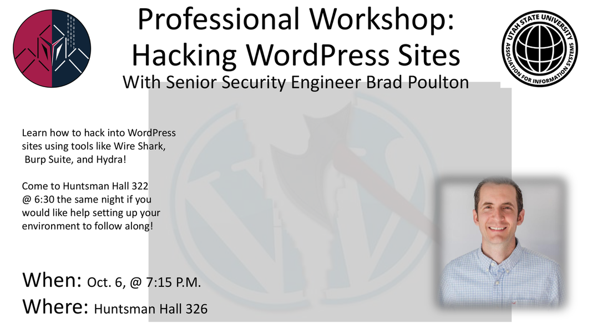

CS2610 - Friday, September 30 - Lecture 14 - Module 2

# Topics:
* [Announcements](#announcements)
* [Mud card followup](#mud-card-followup)
* [Creating your first Django project and app](#creating-your-first-django-project-and-app)
* [What's the difference between a _project_ and an _app_?](#whats-the-difference-between-a-_project_-and-an-_app_)
* [What are all of the files Django makes for me?](#what-are-all-of-the-files-django-makes-for-me)
* [What is MVC and/or MTV?](#what-is-mvc-andor-mtv)
* [Writing your first Django view](#writing-your-first-django-view)

------------------------------------------------------------
# Announcements

## Free Software and Linux Club

*   **What**  uPnP Workshop
*   **When**  6:30pm Wednesday, October 5th
*   **Where** ESLC 053, [FSLC Discord server](https://discord.gg/p4jRxrQmqP)

Have you ever wanted to access your computer from outside of your home network, or host an HTTP or Minecraft server from your home network?  Heard about port forwarding, but don't have admin access to your apartment's router? Come to our uPnP workshop this Wednesday at 6:30PM in ESLC 053 to learn about uPnP and how it can help you more easily forward your ports.

## AIS Workshop: Hacking WordPress Sites 

*   **What**  Professional Hacking Workshop with Senior Security Engineer Brad Poulton
*   **When**  7:15pm Thursday, October 6th
*   **Where** Huntsman Hall 326
    *   Learn how to hack into WordPress sites using tools like WireShark, Burp Suite, and Hydra!
    *   Come to Huntsman Hall 322 @ 6:30 the same night if you would like help setting up your environment to follow along!

# Action Items

*   Work through [The Official Django Tutorial](../Django.md#the-official-django-tutorial) with a goal to finish it by **this weekend**
    *   The Django tutorial walks you through the creation of a *Polls* app
    *   Nearly everything that you will need to know to complete the blog is learned through this tutorial
*   Consider the tutorial to be **required reading** and the Polls app to be part of this **assignment**
    *   Work on the Polls app within the same Django project that you will turn in as your assignment
    *   I don't directly grade your Polls app, but the time spent on the Polls app will be reflected in the *quality* of your Blog app

## Call on 2 designated questioners

# Mud card followup

## Assignment #2 Logistics

> How will we store comments POSTed to a server running locally on our computer?

> How do we save data permanently into the database?

> How does Django store information sent to it, like comments?  Do we write our own list or dictionary, or use something else built into Django?

*   You will use Django's **Object Relational Mapper** (ORM)
    *   The ORM is an Object-Oriented interface to a database
    *   TL;DR instead of writing SQL, you will instead use an API that provides objects which represent your database tables
*   You learn all about the ORM in [tutorial lesson #2](https://docs.djangoproject.com/en/4.1/intro/tutorial02/)
    *   This is, by far, the *largest* of the lessons in the tutorial
    *   Expect to spend the most time on this one
    *   This is, by far, the *most important* of the lessons in the tutorial
    *   Expect to come back to this one a few times to brush up on what it teaches!

> Will I be re-using the website I wrote in the previous two assignments?

*   Yes!
    *   But, there will be twists
*   You will not reuse these pages:
    *   Teapot
    *   Forbidden
    *   Debugging

> How does Django compare to `server.py` from Assignment #1?

*   There is a much steeper learning curve to Django
*   There is much more documentation to read to understand Django
    *   It is my hope that Assignment #1 is a good stepping stone to get you ready for Django

## General Django Questions

> Is Django more geared toward personal projects?  Or is it widely used in companies with lots of data and security needs?

*   It is used by lots of big companies, and many local companies here in the valley.

> Is it common to see Django in the wild?

*   Yes and no
    *   Django is used in [real-world applications](https://www.djangoproject.com/start/overview/) (scroll to the bottom)
*   In fact, you have very likely run across Django sites before *without even realizing it*
    *   After you spend a little time in Django, you may begin to notice which sites use it

> Is Django only used as a server, or does it have other purposes as well?

*   It's just a web framework.

> Is it best to understand the ins and outs of a framework or library before using it?

*   I do not think this is possible
*   Experience is the best teacher
    *   The best way to learn it is to use it!
    *   Approach it from a place of humility, and be open to making mistakes and learning from them

> Does Django have a built-in database?  Or is it through something else?

*   Django connects to external, 3rd-party databases
*   As you'll learn in [tutorial lesson #2](https://docs.djangoproject.com/en/4.1/intro/tutorial02/), Django can connect to a variety of databases
    *   For our purposes we'll just use the default database, [SQLite](https://www.sqlite.org/index.html)

## Miscellaneous

> Do programmers in other countries write most of their stuff in English?

This same question was asked a few semesters ago when this class had a GTA who came from a Spanish-speaking country.  Before coming to USU he had been a software engineer for a number of years.  He told us that, apart from the few programming language keywords (`for`, `if`, `class`, etc.) all of their source code was written in Spanish.  Comments, variables, function and class names were all in the native language.

> What is a REST API, and how does it differ from web API's in general?

*   REST APIs are a *style* of API
    *   This simply means that if you follow a few conventions, you can say that your web API is *RESTful*
    *   You can write both RESTful and non-RESTful APIs in Django
    *   This is a topic that we will cover in this class soon

> What security issues arise from reading data from the user?

*   Nearly **all** of them
*   In the web-dev world, the 2 most common are *SQL-injection* (SQLi) and *Cross-site scripting* (XSS) attacks
    *   We'll learn more about XSS in the last module of this class
    *   We kinda skip over SQLi because Django's ORM does a good job of protecting us from these, but it's very important that you are aware of them

# [Creating your first Django project and app](../Django.md#creating-your-first-django-project-and-app)

The commands described in this section will get you up and running.  Of course, you must first have installed Django on your computer.

# [What's the difference between a _project_ and an _app_?](../Django.md#whats-the-difference-between-a-project-and-an-app)

We will use Django by creating a *project* which contains *apps*.

You will spend most of your time in the *apps* that you write.

# [What are all of the files Django makes for me?](../Django.md#what-are-all-of-the-files-django-makes-for-me)

It is common for code frameworks to provide you with a bunch of boilerplate code.  Part of learning a framework is learning how to navigate and work within this structure.

At this point you are ready to pick up the official Django tutorial, part 1.

# [What is MVC and/or MTV?](../Django.md#what-is-mvc-andor-mtv)

See also [Writing our first Django views](../Django.md#writing-our-first-django-views)

# Writing your first Django view

The Django project I use for in-class demonstrations is part in the lecture notes repository under a directory called `DjangoProj`.  

Please clone the lecture notes repository and follow along with what I do in class:

    git clone https://gitlab.cs.usu.edu/erik.falor/fa22-cs2610-lecturenotes.git

Let's start small and build a few simple views in new app called "hello".

These concepts are explained in the [Django tutorial](https://docs.djangoproject.com/en/4.1/intro/tutorial01/#write-your-first-view)

