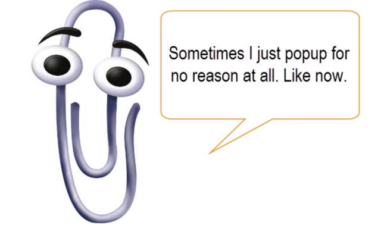

CS2610 - Monday, October 03 - Lecture 15 - Module 2

# Topics:
* [Announcements](#announcements)
* [How *NOT* to create static content](#how-not-to-create-static-content)
* [How *NOT* to create dynamic content](#how-not-to-create-dynamic-content)
* [How well did this little exercise go](#how-well-did-this-little-exercise-go)
* [Effectively generating dynamic HTML content with templates](#effectively-generating-dynamic-html-content-with-templates)
* [Assignment #1 Code ~~Review~~ Roast](#assignment-1-code-review-roast)


------------------------------------------------------------
# Announcements

## Free Software and Linux Club

*   **What**  uPnP Workshop
*   **When**  6:30pm Wednesday, October 5th
*   **Where** ESLC 053, [FSLC Discord server](https://discord.gg/p4jRxrQmqP)

Have you ever wanted to access your computer from outside of your home network, or host an HTTP or Minecraft server from your home network?  Heard about port forwarding, but don't have admin access to your apartment's router? Come to our uPnP workshop this Wednesday at 6:30PM in ESLC 053 to learn about uPnP and how it can help you more easily forward your ports.


## AIS Workshop: Hacking WordPress Sites 

*   **What**  Professional Hacking Workshop with Senior Security Engineer Brad Poulton
*   **When**  7:15pm Thursday, October 6th
*   **Where** Huntsman Hall 326
    *   Learn how to hack into WordPress sites using tools like WireShark, Burp Suite, and Hydra!
    *   Come to Huntsman Hall 322 @ 6:30 the same night if you would like help setting up your environment to follow along!


# Action Items

*   Wrap up the Django Tutorial ASAP so you can begin designing your Django Blog
    *   Start over with a fresh `plan.html`
*   Call on 2 designated questioners


# How *NOT* to create static content

Now that we know how to start up a Django app *and* wire up the connections to make Django call our view function in response to our request, let's see what happens when we scale things up to a larger static page.

Follow along in my [views.py](../../cs2610proj/hello/views.py) file.

I will use the files [template.html](./template.html) and [style.css](./style.css) as my cheat sheets.


# How *NOT* to create dynamic content

The way we just wrote the view function was *tedious*, *repetitive*, and *error-prone*.  And that was just a very simple **static** HTML page.

I worked on webapps a number of years ago, back when Web 2.0 was just getting a start.  Before I show you the **right** way to create a dynamic web page, let's take a look at how people actually used to do this so you can more properly appreciate just how great Django is.

Let's add a webpage with a trivial dynamic element - a visit counter.


## Mud card activity

Write the answers to these prompts on your mud cards (or log on to Piazza and find the thread titled **[Participation] - How NOT to create dynamic content**)

0.  What works well with the approach to developing webapps in-line that I showed in class?
1.  What didn't work so well?
2.  Would you like to write web apps like this?

*Your responses are accepted for participation points until Sunday, Feb 20th at 11:59pm*


# How well did this little exercise go?

Not too well.  The result was unnecessarily difficult.  Let us count the ways that activity wasn't easy or fun:

0.  No syntax highlighting of the HTML within the Python string literal
1.  Problems arise when I embed one language within another language
2.  I'm flattening a tree-like structure down into a 1D string... it might be
    nice to instead treat it like a tree.
3.  We are not separating our concerns; we're combining a big chunk of static
    data with a little sprinkling of executable code.  It would be nice to keep
    these separate.  Because it's easier to think about when each file has 1
    purpose instead of 2.
4.  This approach isn't maintainable - it's like digging a hole that we can't
    climb out of.  As we add more features to this file, it grows
    exponentially.


# Effectively generating dynamic HTML content with templates

We just built a dynamic webpage using some very *questionable* techniques.

The result was unnecessarily difficult.  Let us count the ways that pages sucked:

0.  No syntax highlighting of the HTML within the Python string literal
1.  Problems arise when I embed one language within another language
2.  I'm flattening a tree-like structure down into a 1D string... it might be
    nice to instead treat it like a tree.
3.  We are not separating our concerns; we're combining a big chunk of static
    data with a little sprinkling of executable code.  It would be nice to keep
    these separate.  Because it's easier to think about when each file has 1
    purpose instead of 2.
4.  This approach isn't maintainable - it's like digging a hole that we can't
    climb out of.  As we add more features to this file, it grows exponentially.


## Now that you've seen how *NOT* to do this...

Let's consider the alternative that Django provides: **Templates**

*   [What is a template in Django?](../Django.md#what-is-a-template-in-django)
*   [The Django template language](../Django.md#the-django-template-language)
*   [What are Context Objects in Django?](../Django.md#what-are-context-objects-in-django)


# Assignment #1 Code ~~Review~~ Roast

Here are interesting passages of code students submitted.


## I guess I can see what you're doing with your `Content-Type`

I'm guessing that this student tested their server with Firefox and never ran it in a Chrome-based browser.  If they had, they would have surely noticed that their CSS never loaded.

```python
 1	def ok(self, path):
 2		# The user has asked for or been redirected to an existing page if they come here
 3		f = open(path, "rb")
 4		data = f.read()
 5		f.close()
 6		BaseHTTPRequestHandler.send_response(self, 200)
 7		BaseHTTPRequestHandler.send_header(self, "Connection", "close")
 8		BaseHTTPRequestHandler.send_header(self, "Cache-control", "max-age=1")
 9		BaseHTTPRequestHandler.send_header(self, "Content-type", mimetypes.guess_type(path))
10		BaseHTTPRequestHandler.send_header(self, "Content-length", len(data))
11		BaseHTTPRequestHandler.end_headers(self)
12		self.wfile.write(data)
13	
14	
15	def redirect(self, path):
16		# The user will be sent somewhere else if they're sent here
17		BaseHTTPRequestHandler.send_response(self, 301)
18		BaseHTTPRequestHandler.send_header(self, "Connection", "close")
19		BaseHTTPRequestHandler.send_header(self, "Cache-control", "max-age=1")
20		BaseHTTPRequestHandler.send_header(self, "Content-type", mimetypes.guess_type(path))
21		BaseHTTPRequestHandler.send_header(self, "Location", path)
22		BaseHTTPRequestHandler.end_headers(self)
```

*   **Q**: What is the return type of `mimetypes.guess_type(path)`?
*   **A**: A tuple that looks like `('text/html', None)`

This has been your daily lesson in *RTFM*.

Also, there is no need for the `Content-Type` header on a redirect response.

Additionally, there is no need to explicitly pass `path` into these methods because the `self` object already has a reference to that piece of data.


## When you let somebody else write your code for you...

This example illustrates what I like to call "coding by context menu".  This student submitted code that ran fine on their computer, but crashed when their grader ran it.


```python
from fileinput import filename
from http.server import HTTPServer, BaseHTTPRequestHandler
from importlib.resources import path
import mimetypes
from time import strftime
import sys
import os
```

Do you see the problem?

<details>
<summary>Solution</summary>

*   Do you recognize the modules `fileinput` and `importlib.resources`? 
    *   Because I didn't
    *   I've never heard of these libraries
*   In fact, `importlib.resources` doesn't seem to exist in Python 3.8, which is how we learned about this mistake; because it crashed on the Grader's computer.
*   The fix was easy: simply remove the unused imports
    *   This is the set of imports this program actually 
    *   ```python
        from http.server import HTTPServer, BaseHTTPRequestHandler
        import mimetypes
        from time import strftime
        import os
        ```
*   I believe that this student's IDE underlined code with a bunch of red or yellow squiggles.
    *   Instead of ignoring them like a giga-Chad, I'm guessing this student clicked the IDE's "helpful" pop-up to make the scary colors go away
    *   Giga-Chads don't let Clippy write their code



</details>


## Do as I say, not as I do

When I wrote my HTTP server code in class, it came with the disclaimer that you should *not* simply copy it and work within the style I set forth.

My intent was to teach you about byte strings and the protocol.  My code was simple and naive, but not scalable.

This student either didn't hear or heed my advice, and wrote a nearly 200-line monstrosity:

<details>
<summary>Spoiler: Long</summary>

```python
 1	from http.server import HTTPServer, BaseHTTPRequestHandler
 2	from time import strftime
 3	from pathlib import Path
 4	
 5	
 6	
 7	class CS2610Assn1(BaseHTTPRequestHandler):
 8	    def do_GET(self):
 9	        print(f"You done did a GET for {self.path}")
10	
11	        # file opener
12	
13	        file = Path(self.path[1:])
14	        if file.is_file():
15	            if self.path == "/forbidden.html":
16	                self.wfile.write(b"HTTP/1.0 403 Forbidden\n")
17	            elif self.path == "/teapot.html":
18	                self.wfile.write(b"HTTP/1.0 418 Teapot\n")
19	            else:
20	                self.wfile.write(b"HTTP/1.0 200 OK\n")
21	            self.wfile.write(b"Server: CS2610 server\n")
22	            self.wfile.write(b"Connection: closed\n")
23	            self.wfile.write(b"Cache-Control: max-age=3\n")
24	            self.wfile.write(bytes(f"Date: {strftime('%c')}\n", "utf-8"))
25	            f = open(file, "rb")
26	            data = f.read()
27	            f.close()
28	            self.wfile.write(bytes(f"Content-Length: {len(data) - 20}\n", "utf-8"))
29	            if self.path[-5:] == ".html":
30	                self.wfile.write(b"Content-Type: text/html\n")  # MIME type
31	            elif self.path[-4:] == ".css":
32	                self.wfile.write(b"Content-Type: text/css\n")  # MIME type
33	            elif self.path[-4:] == ".ico" or self.path[-4:] == "jpeg":
34	                self.wfile.write(b"Content-Type: image/x-icon\n")  # MIME type
35	            self.wfile.write(b"\n")
36	            self.wfile.write(data)
37	        
38	        # redirects 
39	
40	        elif self.path == "/" or self.path == "/index":
41	            self.wfile.write(b"HTTP/1.0 301 Moved Permanently\n")
42	            self.wfile.write(b"Server: CS2610 server\n")
43	            self.wfile.write(b"Location: /index.html\n")
44	            self.wfile.write(bytes(f"Date: {strftime('%c')}\n", "utf-8"))
45	            self.wfile.write(b"\n")
46	
47	        elif self.path == "/about" or self.path[0:4] == "/bio":
48	            self.wfile.write(b"HTTP/1.0 301 Moved Permanently\n")
49	            self.wfile.write(b"Server: CS2610 server\n")
50	            self.wfile.write(b"Location: /about.html\n")
51	            self.wfile.write(bytes(f"Date: {strftime('%c')}\n", "utf-8"))
52	            self.wfile.write(b"\n")
53	
54	        elif self.path == "/techtips-css" or self.path == "/tips" or self.path == "/help":
55	            self.wfile.write(b"HTTP/1.0 301 Moved Permanently\n")
56	            self.wfile.write(b"Server: CS2610 server\n")
57	            self.wfile.write(b"Location: /techtips-css.html\n")
58	            self.wfile.write(bytes(f"Date: {strftime('%c')}\n", "utf-8"))
59	            self.wfile.write(b"\n")
60	
61	        elif self.path == "/techtips+css":
62	            self.wfile.write(b"HTTP/1.0 301 Moved Permanently\n")
63	            self.wfile.write(b"Server: CS2610 server\n")
64	            self.wfile.write(b"Location: /techtips+css.html\n")
65	            self.wfile.write(bytes(f"Date: {strftime('%c')}\n", "utf-8"))
66	            self.wfile.write(b"\n")
67	
68	        elif self.path == "/forbidden":
69	            self.wfile.write(b"HTTP/1.0 301 Moved Permanently\n")
70	            self.wfile.write(b"Server: CS2610 server\n")
71	            self.wfile.write(b"Location: /forbidden.html\n")
72	            self.wfile.write(bytes(f"Date: {strftime('%c')}\n", "utf-8"))
73	            self.wfile.write(b"\n")
74	
75	        elif self.path == "/teapot":
76	            self.wfile.write(b"HTTP/1.0 301 Moved Permanently\n")
77	            self.wfile.write(b"Server: CS2610 server\n")
78	            self.wfile.write(b"Location: /teapot.html\n")
79	            self.wfile.write(bytes(f"Date: {strftime('%c')}\n", "utf-8"))
80	            self.wfile.write(b"\n")
81	
82	        # debugging page
83	        
84	        elif self.path == "/debugging.html" or self.path == "/debugging":
85	            self.wfile.write(b"HTTP/1.0 200 OK\n")
86	            self.wfile.write(b"Server: CS2610 server\n")
87	            self.wfile.write(b"Connection: closed\n")
88	            self.wfile.write(b"Cache-Control: max-age=3\n")
89	            self.wfile.write(bytes(f"Date: {strftime('%c')}\n", "utf-8"))
90	            self.wfile.write(b"\n")
91	            data = ""
92	            for value in self.headers.items():
93	                data += "<li><strong>"+ value[0] + ": </strong>" + value[1] + "</li>"
94	            self.wfile.write(bytes(f"""<!DOCTYPE html>
95	                <html lang="en">
96	                    <head>
97	                        <meta charset="utf-8">
98	                        <title> debugging </title>
99	                    </head>
100	                    <body>
101	                        <h1> Server Debugging Page! </h1>
102	                        <h2> You got what you asked for </h2>
103	                            <p> You are visiting <strong> {self.path} </strong> from IP adress <strong> {self.client_address[0]} </strong>, port number <strong> {self.client_address[1]}</strong></p> 
104	                            <p> it is now <strong> {strftime('%c')} </strong>
105	                        <ul>
106	                            <li><strong>Command:</strong> {self.command} </li>
107	                            <li><strong>Path:</strong> {self.path} </li>
108	                            <li><strong>Requestversion:</strong> {self.request_version} </li>
109	                            <li><strong>Version String:</strong> {self.server_version}/{self.sys_version} </li>
110	                        </ul>
111	                        <h2> Request Headers </h2>
112	                        <ol>
113	                            {data}
114	                        </ol>
115	                        <p>Could I interest you in the <a href="/">HOME PAGE</a>?</p>
116	                    </body>
117	                </html>
118	                \n""", encoding="utf-8"))
119	
120	
121	
122	        # elif self.path == "/debugging.html" or self.path == "/debugging":
123	        #     self.wfile.write(b"Http/1.0 200 OK\n")
124	        #     self.wfile.write(b"Server: CS2610 server\n")
125	        #     self.wfile.write(bytes(f"Date: {strftime('%c')}\n", "utf-8"))
126	        #     self.wfile.write(b"\n")
127	        #     page = self.path
128	        #     self.wfile.write(b"""<!DOCTYPE html>
129	        #         <html lang="en">
130	        #             <head>
131	        #                 <meta charset="utf-8">
132	        #                 <title> debugging </title>
133	        #             </head>
134	        #             <body>
135	        #                 <h1> Server Debugging Page! </h1>
136	        #                 <h2> You got what you asked for </h2>
137	        #                 <p> You are visiting <strong> #PAGE </strong> from IP adress <strong> #IPADDRESS </strong>, port number <strong> #PORT </strong></p> 
138	        #                 <p> it is now <strong> #DATE </strong>
139	        #                 <ul>
140	        #                     <li><strong>Command:</strong> #COMMAND </li>
141	        #                     <li><strong>Path:</strong> #PATH </li>
142	        #                     <li><strong>Requestversion:</strong> #REQUEST VERSION</li>
143	        #                     <li><strong>Version String:</strong> #VERSION </li>
144	        #                 </ul>
145	        #                 <h2> Request Headers </h2>
146	        #                 <ol>
147	        #                     <li> Host: #HOST </li>
148	        #                     <li> User: #User</li>
149	        #                     <li> Accept: #ACCEPT </li>
150	        #                     <li> Accept-Language: #LANG </li>
151	        #                     <li> Accept_Encoding: #ENCODING </li>
152	        #                     <li> DNT: #DNT </li>
153	        #                     <li> Connection: #KEEP ALIVE </li>
154	        #                     <li> Refer: #REFER </li>
155	        #                     <li> Upgrade-Insecure-Requests: #INSECURE </li>
156	        #                 </ol>
157	        #                 <p>Could I interest you in the <a href="/">HOME PAGE</a>?</p>
158	        #             </body>
159	        #         </html>
160	        #         \n""")
161	
162	            # display server verstion string
163	            #       public string VersionString { get; }
164	            # display servers current date and time 
165	            # display client's IP address and port number as obsered by server
166	            # display the path requested by client 
167	            # display the HTTP request type (aka command)
168	            # display the HTTP version of this request 
169	            # display an ordered list of the HTTP request headers sent by the browser
170	
171	        # 404
172	
173	        else:
174	            self.wfile.write(b"HTTP/1.0 404 Bad Request\n")
175	            self.wfile.write(b"Server: CS2610 server\n")
176	            self.wfile.write(bytes(f"Date: {strftime('%c')}\n", "utf-8"))
177	            self.wfile.write(b"\n")
178	            f = open("404.html", "rb")
179	            data = f.read()
180	            f.close()
181	            self.wfile.write(data)
182	
183	if __name__ == '__main__':
184	    server_address = ('localhost', 8000)
185	    print(f"Serving from http://{server_address[0]}:{server_address[1]}")
186	    print("Press Ctrl-C to quit\n")
187	    try:
188	        HTTPServer(server_address, CS2610Assn1).serve_forever()
189	    except KeyboardInterrupt:
190	        print(" Exiting")
191	        exit(0)
```

</details>

*   Granted, almost 40 lines of this program is a passage that is commented out.
    *   But that is exactly the use-case that Git was created for.
    *   Instead of carrying that cruft around in your program, just delete it!
    *   You can always go back and find it again in Git's log.
*   Each branch of `do_GET()`'s if/elif/else tree duplicated many lines of code.
    *   The HTTP response line can is more easily dealt with by the `http.server` library's `send_response()` method.
    *   Two of those headers, `Server` and `Date` are automatically handled by the `http.server` library's `send_response()` method.
        *   This has been your 2nd daily lesson in *RTFM*
        *   In my solution I abstracted this out into one 10-line method called `do_response()` which handles all of this once and only once:
        *   ```python
             1	def do_response(self, code=200, custom=dict()):
             2	    self.send_response(code)
             3	    headers = {
             4	            'Connection': 'close',
             5	            'Cache-Control': 'max-age=6',
             6	            }
             7	    headers.update(custom)
             8	    for header, value in headers.items():
             9	        self.send_header(header, value)
            10	    self.end_headers()
            ```
        *   But the real tragedy is the long passage of redirects from lines 38-80; that could have been factored out into a single one-line function:
           *    ```python
                def redirect(self, location = '/index.html'):
                    self.do_headers(301, {'Location': location})
                ```
*   This student's final sin is misnaming their `.gitignore` as `gitignore`.
    *   Please don't repeat this mistake on the Django assignment!


