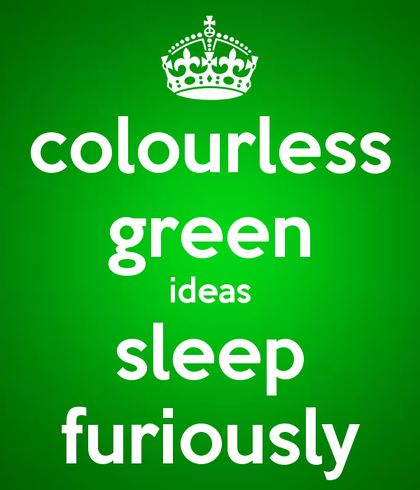

CS2610 - Wednesday, October 12 - Lecture 19 - Module 3

# Topics:
* [Announcements](#announcements)
* [What questions do you have about Assignment #2](#what-questions-do-you-have-about-assignment-2)
* [Models in practice: finish the `HighFive` demo](#models-in-practice-finish-the-highfive-demo)
* [Intro to JavaScript](#intro-to-javascript)

------------------------------------------------------------
# Announcements

# Action Items

*   Call on 2 designated questioners

# What questions do you have about Assignment #2?

Assignment 2: Dynamic Django Blog is due Sunday, October 16th at midnight

*   What challenges are you facing?
*   What questions do you have?

# Models in practice: finish the `HighFive` demo

Let's put the finishing touches on my **hello** app's `HighFiveLog` model and template.

# [Intro to JavaScript](../JavaScript.md)

**Jot down your impressions and questions about JavaScript on your mud cards**

## When picking up a new language there are only 2 things you need to learn

0.  **Syntax** - the *form* of the language
    *   What symbols is the language comprised of?
    *   What order may I arrange the symbols of the language?
1.  **Semantics** - the *meaning* of the language
    *   Is this particular ordering of symbols nonsense?
    *   What meaning do these symbols have when arranged this way?

This is famous quote that is valid **syntactically** but not **semantically**:

Despite the lack of grammatical errors, this sentence doesn't make sense.

