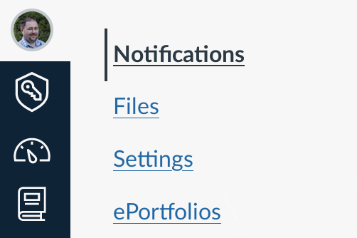
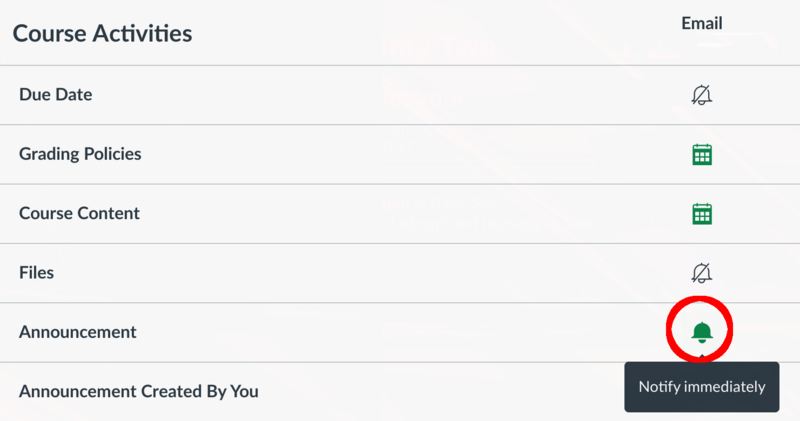

CS2610 - Monday, October 17 - Lecture 20 - Module 3

# Topics:
* [Announcements](#announcements)
* [Mud card followup: Introduction to JavaScript](#mud-card-followup-introduction-to-javascript)
* [Introduce Assignment #3](#introduce-assignment-3)
* [Remember the difference between syntax and semantics](#remember-the-difference-between-syntax-and-semantics)
* [Intro to JavaScript continued](#intro-to-javascript-continued)
* [`grades.js` - a practice program](#gradesjs-a-practice-program)


------------------------------------------------------------
# Announcements

## Mike Lee vs. Evan McMullin Debate Watch Party

*   **When**  6:00pm Monday, October 17th
*   **Where** TSC Sunburst Lounge

Refreshments will be provided!


## Are You Getting Canvas Announcements? Check your Canvas settings

While we always strive to give you correct and accurate instructions on every assignment, unfortunately some mistakes still make it out.  When we find and correct mistakes we will notify the class through a Canvas announcement, as this is the fastest way to reach everybody.  However, some students didn't hear about some of the bug fixes we published last week.

To ensure that you are notified as quickly as possible, make these changes in Canvas:

0.  Click your Canvas avatar in the left sidebar to open the Canvas account menu
1.  Select **Settings**
2.  Make sure that an email address that you actively monitor is set under **Ways to Contact**
3.  Click the **Notifications** menu item
    *   
4.  Find **Announcements** in the list and click the icon under your email address until it appears as a bell
    *   


# Mud card followup: Introduction to JavaScript

## General questions about JavaScript

### Is JavaScript easy to learn and hard to master?

*   Honestly, you could say this about many languages
*   I'd say that JavaScript is easy to learn because it is popular - this means there are plenty of tutorials, guides, etc.  Not to mention that your Browser is a very nice REPL.
*   It's hard to master because there are so many sharp corners to get snagged on, and lots of things that are done a certain way for no real good reason


### What other ways would you recommend learning JavaScript?

*   Write lots of code


### Does JavaScript have an IDE?

*   Yes, there are a few, such as VSCode and WebStorm


### JavaScript updates every summer...

*...is this a common thing across languages?*

*   No.  Some languages have a regular release, some never change, others are updated sporadically.


### Do these yearly updates ever break existing JavaScript programs?

*   They take great care to avoid doing that
*   I think this explains some of the language's odd features
    *   It's hard to add new features in a way that does not conflict with existing codebases
*   This is one of the troubles of learning JavaScript from the internet
    *   it is way too easy to come across out-dated information


### Do we need to buy the book "JavaScript: The Good Parts"?

*   It's not required for this class
*   I recommend it if you want to become a serious JavaScript programmer


### What is the difference between `null` and `undefined`

*   `undefined` is the value of a variable that has been declared but not given a value:
*   `undefined` is returned by a function which exits without encountering a `return` statement, or when `return` is used without a value

```javascript
var a;
console.log(a);  // undefined

function junk() {
    return;
}
var b = junk();  // undefined
```

The MDN has this to say about `null:

> The value `null` is written with a literal: `null`. `null` is not an identifier for a property of the global object, like `undefined` can be. Instead, `null` expresses a lack of identification, indicating that a variable points to no object. In APIs, `null` is often retrieved in a place where an object can be expected but no object is relevant. 

They are both falsy (meaning that both values coerce to `false` in the context of a conditional statement).  If you ever need to distinguish between them, use `===`.

Instead of the example above of `a`, I should have declared it like this:

```javascript
var a = null;
```

This conveys my intent that the variable `a` exists, but hasn't yet been give a "real" value.

*   [MDN: Difference between null and undefined](https://developer.mozilla.org/en-US/docs/Web/JavaScript/Reference/Operators/null#description)


## JavaScript Hate

### If JavaScript is so widely used, why is it widely hated?

*   This was the most asked question
*   There's always a language that people like to dump on.
    *   Before JavaScript it was Visual Basic, and before that there was COBOL
    *   I'm sure I'm forgetting one or two


### If JavaScript has so many weird quirks, is it more prone to bugs or vulnerabilities?

*   In the hands of a JS novice, I'd say yes
    *   You can say this about *any* language
*   I'll try my best to point out some of the most glaring issues as we go along


### Which language is more powerful, JavaScript or C++?

*   This question is a bit like asking "which tool is better, a hammer or a cheese grater?"
    *   The right answer is "it depends on what you're trying to do"
*   Both languages are Turing-Complete
    *   The academic answer is "neither"
*   Both of the mainstream JavaScript interpreters/engines are written in C++
    *   The smart-aleck answer is "C++!"


### JavaScript feels like it was written in 10 days...

*   I have that same feel
    *   [The Weird History of JavaScript](https://www.youtube.com/watch?v=Sh6lK57Cuk4)


### In your opinion, will JavaScript always rule the web?

*   No
    *   I don't think it will entirely go away in our lifetimes, but something bigger & better will come along in a decade or two
    *   The [replacement](https://webassembly.org/) may already be upon us


## Servers

### For every website that exists, is there a computer somewhere dedicated to running the server for it?

*   Yep!


### How truly difficult is it to create a server...

*...for anyone on the globe to reach?*

*   Not very hard at all!
*   If time permits, later in the semester your TA Taylor Anderson will show you one way to do it


### Would it be dangerous to host my Django website on a Raspberry Pi at home?

*   Not particularly
    *   Just be careful with data supplied by visitors
    *   Assume they are all Russian Hackers
    *   Don't use evil `eval()`


### How hard is it to set up/run a Raspberry Pi server?

*   Not particularly
    *   This is a good question for the [Free Software and Linux Club](https://discord.gg/p4jRxrQmqP)


### Is it risky to configure my home router to let in outside traffic just to show off?

*   Not particularly
    *   If you turn off your server, those packets won't have anywhere to go
*   "Port forwarding" is the router feature you are looking for


# Introduce Assignment #3

[Interactive JavaScript Calculator](https://usu.instructure.com/courses/684231/assignments/3611576)

*   You should begin phase **0. Requirements Specification** for this assignment **today**
    *   Set a goal to complete phase **1. System Analysis** and begin phase **2. Design** by **Friday**


# Remember the difference between syntax and semantics

When working with JavaScript always bear in mind:

*   The *syntax* of JavaScript was designed to be similar to the most widespread programming languages of the early 90's: C/C++/Java
*   The *semantics* of JavaScript are drawn from the *functional* programming language [Scheme](https://schemers.org/) as well as Object-Oriented languages such as [Self](https://selflanguage.org/) and [Smalltalk](http://www.smalltalk.org/)

**TL;DR** Just because something *looks* familiar doesn't mean that it will *behave* as you expect.


## Isn't JavaScript basically Scheme but with better syntax?

Watch your tongue!

It has been said of JavaScript that it is "Scheme with curly braces".  As a Scheme hacker let me assure you that this saying is **extremely** offensive.  It is best not uttered in polite company, and you should never, under any circumstances *ever* delude yourself into thinking that you understand anything about Scheme because you know a little JavaScript.

Scheme is as pure and beautiful as the driven snow.  If JavaScript were a fine, powdery substance it would be coal dust.  Wash your hands when you are done playing with it :-P


# Intro to JavaScript continued

Let's pick up from our previous discussion and build towards writing a real JavaScript program

*   Basic features of the JavaScript language
    *   [What about Arrays?](../JavaScript.md#what-about-arrays)
    *   [Numbers and arithmetic operators](../JavaScript.md#numbers-and-arithmetic-operators)
    *   [Comparison operators](../JavaScript.md#comparison-operators)
*   [Variables, Scope and Conditionals](../JavaScript.md#variables-scope-and-conditionals)
*   [Objects](../JavaScript.md#objects)
*   [Loops and iteration](../JavaScript.md#loops-and-iteration)


# `grades.js` - a practice program

Let's practice using the various primitive features of this language by writing
a small program that we can run in the browser.

Fill in the function `grades()` which takes a list of scores and then assigns letter grades such that:
                                                                                  
* Scores within 10% of the greatest score are A's
* Scores within 20% of the greatest score are B's
* Scores within 30% of the greatest score are C's
* Scores within 40% of the greatest score are D's
* Remaining scores are F's
                                                                                  
Report the following information:

* Number of submissions made
* The maximum score
* Number of scores that fall into each letter grade
* Each individual student's letter grade and score
    *   Students are identified by the order of their submission
    *   e.g. Student #0, Student #1, ...

We will use the following JavaScript features to write this code:

*   Variables
*   Numbers and arithmetic operations
*   Boolean expressions
*   `if`/`else if`/`else`
*   Loops
*   Arrays
*   Objects
*   Printing to the console with `console.log()`
*   Strings and template strings
*   Functions

The script can be run by loading the file [grades.html](./grades.html) in a browser.  For now we'll look to the JavaScript Console for the program's output.

[The 'grades.js' JavaScript program](./grades.js)


