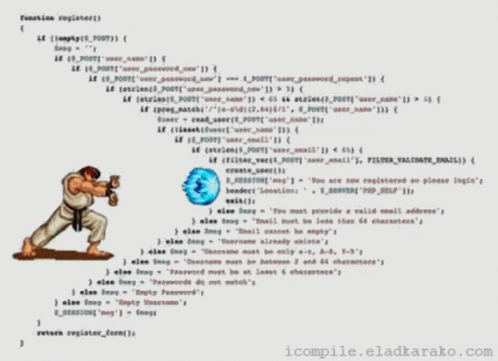

# Web APIs

## Table of Contents

* [Modern web applications leverage APIs in two ways](#modern-web-applications-leverage-apis-in-two-ways)
* [How do I learn how to use a web API?](#how-do-i-learn-how-to-use-a-web-api)
* [What is an API key?](#what-is-an-api-key)
* [What tools can I use to access web APIs?](#what-tools-can-i-use-to-access-web-apis)
* [JavaScript Object Notation](#javascript-object-notation)
* [A list of free public APIs](#a-list-of-free-public-apis)
* [Promises & `fetch()`](#promises-fetch)


## Modern web applications leverage APIs in two ways

We had been using the term *API* to describe how code we write interfaces with
pre-written systems to access computational resources on our own machines

* Django's ORM is an API which gives us convenient control over a database
  using familiar Object-Oriented syntax and idioms
* The DOM in the browser is an API for manipulating a hierarchical HTML document

Now we shall consider web APIs which enable us to use resources distributed
across the internet and made accessible through HTTP.


### Web APIs provide division of labor

An application's front-end code (HTML, CSS, JavaScript) is written in a
different language from the back-end code (e.g. Python). Data is sent
back-and-forth between both sides of the application using a common language
that both sides will understand (e.g. XML, JSON).

In this situation the form of the API itself is under full control of the
application developers, who use it solely in support of the front-end which is
their "product".


### Web APIs enable access to 3rd-party services

An application may consist of a simple front-end UI which ties together many
different sources of data and services provided by other developers. The API is
not under the control of the application developers; they are customers of the
API just as their clients are customers of the front-end webpage itself.

In this situation there are 3rd party companies who create an API as a
"product". Other devs include these APIs into their own products. This makes
you and I indirect customers of the API developers.

Real-world web apps use both approaches at the same time.  You use APIs several
times per day, whether or not you know it.


## How do I learn how to use a web API?

Using a web API is analogous to calling a function in a programming language.
Learning how to use a library of code comes down to learning three things:

1. What are the names of functions to call?
2. What parameters do the functions accept?
3. What is the output of the functions?


For web APIs, these questions become:

1. What are the URLs I can make requests of?
2. Which HTTP request types do I use, and what parameters may I send?
3. What is the output of the API?


### What are the URLs I can make requests of?

Web APIs are accessed by making HTTP requests.  To use the API you need a way
to make HTTP requests: a web browser, a simple command-line program, or your
favorite programming language will serve.  You will need to learn which URLs
lead to a web application providing a resource you need.


### Which HTTP request types do I use, and what parameters may I send?

The web application providing a resource may respond only to certain HTTP
request types (GET, POST, PUT, DELETE, etc.).  The API resource may require
sending parameters, just as you've done with HTML forms in Django.


### What is the output of the API?

APIs may return data in a number of formats, such as

* JSON
* XML
* Plain-text
* HTML

Additionally, because the API's reply comes in the form of an HTTP response,
you will also receive an HTTP response code (200 OK, 404 Not Found, etc.) as
well as HTTP headers which may bear important information.


### Look for API Documentation/Instructions

APIs intended for public consumption will have a webpage describing this
information so developers can make apps using their carefully crafted API.

As an example of a simple, well-documented API, consider the
[Deck of Cards API](http://deckofcardsapi.com/).  As a bonus, it's implemented
in Django!  Go take a look at it on GitHub.  Since you're familiar with Django
you'll find yourself right at home!


## What is an API key?

An API key is a small, randomly-generated piece of text that functions as both a username and a password.  They tend to look like this:

*   `94765891130381748316486`
*   `chafIkberregsUldom5`
*   `PrynAn9reddcydsOitt`
*   `byRyaskAc1-odCestyirf`

An API key is included with requests to identify individual users of the service (by "user", I don't mean an individual at home that is browsing the web, but whoever operates the website).  For example, a business may provide a map on their website to help potential customers find their location.  When the customer visits the page and downloads its HTML, the browser will encounter a URL containing that businesses' API key.

Example: [Kilby Court + Google Maps API](https://www.kilbycourt.com/)

### How do I keep API keys secure?

A question that often comes up is "How would one go about passing an API token in the case that they are sensitive?"

To understand the answer to this question, you must first model the *threat* you face.  What's the worst thing that could happen if the API key fell into the wrong hands?

Are we talking about your personal Canvas API key, or your NASDAQ Data Link key that grants access to freely-available public information?

The amount of security you give your API key should be commensurate with the level of abuse that's possible.

The worst thing that could happen with your...

*   ...Canvas key is that somebody can impersonate you and see your grades
*   ...NASDAQ key is that a prankster locks you out of your account for a few hours


### API Key Operational Security

*   When you want your end-users to make requests from their computers on your behalf, don't give them a sensitive API key
*   You can make lots of API keys and rotate them in and out of use
    *   Create separate keys for each website/app you create to isolate the effects of abuse on any one of them

If you need your end-users to directly access a sensitive API from their own browser, there are schemes for doing this that involves an extra layer of verification.  Instead of sharing the sensitive API key with end-users, you give out a new, disposable API key that has a limited shelf-life.  When the end-user presents that key to the secure API, it checks back in with you to ask if you "vouch" for that user.  


## What tools can I use to access web APIs?

Once you have identified an API and located its documentation, you will need to
find a way to send HTTP requests to it.  Here are some programs from which you
can issue requests.

### Your browser

Many web APIs respond to simple GET requests.  To use these services, simply
enter a URL directly into the browser's address bar.  Firefox will pretty-print
JSON responses automatically.  The Network tab in Firefox's developer tools
enables you to edit and resend requests, giving you the ability to perform
other HTTP requests such as POST, PUT and DELETE.


### Browser plugins

Your browser's address bar has a few drawbacks, especially when the request URL
becomes complex.  The RESTED add-on for Firefox provides a convenient GUI to
make and save elaborate requests.

*   [RESTED Add-On for Firefox](https://addons.mozilla.org/en-US/firefox/addon/rested/)
*   Chrome used to have a really good plugin called
    [Postman](https://chrome.google.com/webstore/detail/postman/fhbjgbiflinjbdggehcddcbncdddomop),
    but this is now deprecated in favor of a
    [bloated Chrome native app](https://www.getpostman.com/downloads/)


### `curl`: The Internet Swiss Army Knife

* [curl Home](https://curl.haxx.se/)

While browser plugins are useful for interactive work, they have their drawbacks:

*   Browser plugins are not universal: Firefox plugins don't work on Chrome and
    vice versa.
*   Browsers as platform are notoriously unstable; when a plugin's author
    doesn't fastidiously keep up with rapid changes in technology the plugin
    quickly becomes obsolete (viz. the Postman on Chrome situation)
*   Browsers support only a limited range of protocols HTTP, HTTPS, and
    possibly FTP.  While the recent trend has been to move everything onto
    HTTP/HTTPS, the internet is much bigger than what you can experience in a
    browser
*   GUI programs are difficult to automate

`curl` is a simple command line program for accessing online resources.  Think of
it as a browser without a GUI.  Because it is available on all operating
systems, it is used in API documentation as a universal example that will work
on anybody's computer.  `curl` can make all of the HTTP requests: GET, PUT, POST,
etc., as well as speak other internet protocols.  It's a very nice way to test
out or use an API, especially since you can call it from a script for maximum
automation.

*   **Linux and Mac users**: `curl` may already be installed.
    *   Pop a terminal, run `curl`, and look for this message:
    *   ```
        curl: no URL specified!
        curl: try 'curl --help' or 'curl --manual' for more information
        ```
    *   If you instead see `command not found`, install it from your Linux package manager, Homebrew on Mac, or download from the curl homepage
*   **Windows ~~users~~sufferers**
    *   `curl` is installed in Git+Bash
    *   If you use PowerShell, be aware that Microsoft provides a cmdlet called `curl` which purports to be a replacement for the real thing
        *   [Lies!](https://discoposse.com/2012/06/30/powershell-invoke-restmethod-putting-the-curl-in-your-shell/)
        *   [Closer, but still wrong](https://adamtheautomator.com/powershell-curl/#Myth_Busting_PowerShell_Cmdlets_Curl)
    *   The "curl" cmdlet in PowerShell is a drop-in replacement for `curl` in the same way that Twitter is a drop-in replacement for having friends
    *   You should install the real thing
    *   Whenever you see me run `curl`, replace that with `curl.exe` so that you are sure to run the correct program

If you are a Windows ~~user~~sufferer it was installed with Git+Bash.  Otherwise, you can download a compatible package from https://curl.haxx.se/download.html


### curl command line usage

    curl [OPTIONS] URL...

Be advised that when sending GET requests your command shell might misinterpret
special characters such as `?` and `&`, leading to confusing errors.  Surround
URLs with single or double quotes to ensure that your shell doesn't
misinterpret your command.

`curl`'s command-line syntax is simple, though there are many options.
Here are the most important options for you to know:


#### Specify the type of HTTP Request

Like the web browser, curl sends GET requests by default.  Use the `-X REQTYPE`
option to specify another request type.  Examples:

    $ curl           URL
    $ curl -X PUT    URL
    $ curl -X POST   URL
    $ curl -X DELETE URL


PUT and POST requests which need to send data that is not part of the URL can
specify that data with the `--data "DATA"` option.

**Shorten a long URL**

This command posts a string to a URL shortening service.  The format of the input is like that of an HTML Form: a sequence of `name=value` pairs separated by ampersands (however in this case there is only 1 pair, so no ampersands are needed):

```bash
$ curl -X POST --data 'url=https://www.usu.edu/cs/assessment/undergraduate/expected-level-of-attainment' https://cleanuri.com/api/v1/shorten
```

This API will also accept JSON data if you send the appropriate `Content-Type` header along in the request.
Notice that the JSON data is surrounded by single-quotes to prevent the command shell from misinterpreting
the curly brackets as well as to regard the block of JSON as a single entity.
Within the string of JSON data double-quotes are use because JSON **does not*
accept any other type of quote mark:

```bash
$ curl -X POST -H "Content-Type: application/json" --data '{"url": "https://www.usu.edu/cs/assessment/undergraduate/expected-level-of-attainment"}' https://cleanuri.com/api/v1/shorten
```


#### Specify HTTP Headers

Some APIs use HTTP Headers sent by the user as input.  These headers may be
used for authentication (e.g. an API key or username/password), or to specify
the format of the data the user wants to receive.  HTTP Headers are specified
with the `-H HEADER_STRING` option.

Using "ICanHazDadJoke.com" as an example, an ordinary GET request fetches the website's HTML.

By using the `Accept` header, the user may request a joke in either JSON or plain-text.

**Request a Dad Joke**

By default, this request retrieves the website in HTML:

```bash
$ curl https://icanhazdadjoke.com/
<!DOCTYPE html>
<html lang="en">
<head>
<meta charset="utf-8">
...
```

Tell the server you can accept plain text:

```bash
$ curl -H "Accept: text/plain" https://icanhazdadjoke.com/
Did you know you should always take an extra pair of pants golfing? Just in case you get a hole in one.
```

Or, request a joke written in JSON:

```bash
$ curl -H "Accept: application/json" https://icanhazdadjoke.com/
{"id":"VKe2gNCQnb","joke":"What do you call a group of killer whales playing instruments? An Orca-stra.","status":200}
```


#### Specify the User-Agent

Recall that the `User-Agent` header is automatically sent by browsers and may
be used by servers to determine compatibility or to decide whether to respond
with the full-sized "Desktop" web page or a smaller "Mobile" version.

Many APIs will refuse to serve requests arriving from unidentified clients.
These APIs don't necessarily expect that your User-Agent string matches that of
a well-known browser, they just expect *something*.

You could use `-H "User-Agent: UA_ID"` to identify your request, but because
this is a very common need, curl provides the shortcut `-A UA_ID`.

`curl -A "My Legitimate User-Agent" URL`

**Request facts about an album called "Waking Season"**

The MusicBrainz API asks that you identify your requests with the `User-Agent`
header:

```bash
$ curl -A "cs2610 (erik.falor@usu.edu)" "https://musicbrainz.org/ws/2/recording?fmt=json&limit=3&query=waking+season"
```


## JavaScript Object Notation

> JSON (JavaScript Object Notation) is a lightweight data-interchange format.
> It is easy for humans to read and write. It is easy for machines to parse and
> generate. It is based on a subset of the JavaScript Programming Language
> Standard.
>
> -- https://www.json.org/json-en.html


### Online resources about JSON

* [JSON.org](http://json.org/) - The official JSON specification by Douglas Crockford
* [JSONLint](https://jsonlint.com/) - A JSON syntax validator
* [MDN - JSON Browser API](https://developer.mozilla.org/en-US/docs/Web/JavaScript/Reference/Global_Objects/JSON)


### Use curl on the XKCD comic API

The XKCD API is described [here](https://xkcd.com/json.html).  This
documentation explains:

* Which URLs you can use
* What information to put into the HTTP request

Let's try one out:

    $ curl https://xkcd.com/149/info.0.json


What on earth are we looking at?  This data is expressed as JSON - JavaScript Object Notation.


JSON looks like JavaScript, but it is _not_ equal to JavaScript.  Be sure to
read the MDN article above to learn what the differences are.  JSON is a subset
of the JavaScript programming language.  In particular, JSON embodies the
syntax of "objects" in JavaScript, which are equivalent to dictionaries in
Python.

Like Python's dictionaries, the following is true of objects in JavaScript:

* Objects are a mapping of key-value pairs
* Each key must be unique
* Keys may be any string
* The values can be any JavaScript value, including functions and other objects
* Object literals are delimited with curly braces

The keys in JavaScript objects are most often referred to as "properties".
An object's properties can be referred two by two different syntaxes:

* OOP syntax: `console.log( obj.property )`
* Array syntax: `console.log( obj['property'] )`
* Creating a new object: `var o = { 'name': "Park Place", 'price': 350, 'rent': 35 };`


### Differences between JavaScript and JSON

You can paste JSON into the JavaScript console and expect it to work.  But you
can't take arbitrary JavaScript code and pass it off as JSON.  Here are some of
the key differences:

*   Property names (a.k.a. keys) *must* be quoted, no exceptions.  This even
    goes for property names that are numbers.
*   You cannot use single quotes `'` around strings in JSON.  If your string
    data contains a double quote `"` you must escape it with a backslash `\`
*   JSON cannot contain functions.
*   There is no syntax for comments.  `//` and `/* */` won't work.
*   Trailing commas are considered an error.  The comma after the `2` below is
    okay in JavaScript but is a syntax error to JSON:
    ```javascript
    {
        "one": 1,
        "two": 2,
    }
    ```


### Using JSON within Python

In Assignment 5 you will create a Django view which responds to GET requests by
returning JSON to the browser.  Because of the close correspondence between
Python dictionaries and JavaScript Objects this is very simple for you.

*   [Python json package](https://docs.python.org/3.9/library/json.html)
    Python's `json` package provides a convenient way to convert between Python
    data structures and their JSON equivalents.
*   [JsonResponse](https://docs.djangoproject.com/en/3.1/ref/request-response/#jsonresponse-objects)
    Django's `JsonResponse` class is analogous to the `HttpResponse`s that your
    views have been returning all along.  The `JsonResponse` may be used
    instead to conveniently transform a Python dictionary into JSON and send it
    to the browser with extra metadata that helps the browser make better use
    of it.


### Using curl + Python to pretty-print JSON data:

The JSON we have been getting from servers is a little hard for us humans to
read.

Python's built-in `json` package provides methods for creating/consuming JSON
data. Fortunately, it can conveniently be used from the command line to
pretty-print JSON data such that it becomes easy to read.

Pipe curl's output to `python -m json.tool`, like this:

    $ curl "https://archive.org/wayback/available?url=pokemon.com" | python -m json.tool


Explanation:
------------
The `curl` program makes a GET request of the provided URL and prints the
resulting JSON data. The '|' character on the command-line sends the data to
the Python program instead of to the screen.

The -m flag instructs Python to load the `json.tool` module. This module reads
whatever data is sent to its standard input, adds white space as appropriate,
and sends that to its standard output.

Ordinarily, a program's so-called "standard input" is the keyboard, and
"standard output" is the screen. The pipe character tells the shell to hook the
standard output of the program on the left to the standard input of the program
on the right.

For your convenience, here are some shell programs that cut down on the typing:


### pretty.sh

```shell
#!/bin/sh
curl $@ | python -m json.tool
```


### pretty.bat

```shell
@curl "%1" "%2" "%3" "%4" "%5" "%6" "%7" "%8" "%9" | python -m json.tool
```


### XML - eXtensible Markup Language

In the early days of web APIs, response data would have been provided in a
format called XML.  These days most web APIs provide data in the JSON format,
so you should be glad that we're not in the early days anymore!


You'll notice that XML resembles HTML, featuring "tags" formed with angle
brackets, elements and attributes.  Even today, there are still some APIs which
send results only in XML.  Some APIs allow the user to request which format
their application prefers to take its data (https://data.nasdaq.com, for
example, gives you this choice).

Here is an example of the same API response expressed both in XML and JSON so
you can see for yourself the differences:


### MusicBrainz response in XML

The data returned by MusicBrainz is intended for a computer to consume, and
comes without any unnecessary whitespace or indentation.  Here I use the
external tool [xmllint](http://xmlsoft.org/) from the Libxml project to
pretty-print this block of XML:

<details>

<summary><code>$ curl -s -A "cs2610 (erik.falor@usu.edu)" "https://musicbrainz.org/ws/2/artist?fmt=xml&limit=3&query=artist:nirvana%20AND%20country:us" | xmllint --format -</code></summary>

```xml
<?xml version="1.0" encoding="UTF-8" standalone="yes"?>
<metadata xmlns="http://musicbrainz.org/ns/mmd-2.0#" xmlns:ns2="http://musicbrainz.org/ns/ext#-2.0" created="2020-10-30T17:59:38.838Z">
  <artist-list count="3" offset="0">
    <artist id="5b11f4ce-a62d-471e-81fc-a69a8278c7da" type="Group" type-id="e431f5f6-b5d2-343d-8b36-72607fffb74b" ns2:score="100">
      <name>Nirvana</name>
      <sort-name>Nirvana</sort-name>
      <country>US</country>
      <area id="489ce91b-6658-3307-9877-795b68554c98" type="Country" type-id="06dd0ae4-8c74-30bb-b43d-95dcedf961de">
        <name>United States</name>
        <sort-name>United States</sort-name>
        <life-span>
          <ended>false</ended>
        </life-span>
      </area>
      <begin-area id="a640b45c-c173-49b1-8030-973603e895b5" type="City" type-id="6fd8f29a-3d0a-32fc-980d-ea697b69da78">
        <name>Aberdeen</name>
        <sort-name>Aberdeen</sort-name>
        <life-span>
          <ended>false</ended>
        </life-span>
      </begin-area>
      <disambiguation>90s US grunge band</disambiguation>
      <isni-list>
        <isni>0000000123486830</isni>
        <isni>0000000123487390</isni>
      </isni-list>
      <life-span>
        <begin>1988-01</begin>
        <end>1994-04-05</end>
        <ended>true</ended>
      </life-span>
      <alias-list>
        <alias locale="ja" sort-name="ニルヴァーナ" type="Artist name" type-id="894afba6-2816-3c24-8072-eadb66bd04bc" primary="primary">ニルヴァーナ</alias>
        <alias sort-name="Nirvana US">Nirvana US</alias>
        <alias locale="en" sort-name="Nirvana" type="Artist name" type-id="894afba6-2816-3c24-8072-eadb66bd04bc" primary="primary">Nirvana</alias>
      </alias-list>
      <tag-list>
        <tag count="2">
          <name>usa</name>
        </tag>
        <tag count="0">
          <name>united states</name>
        </tag>
        <tag count="0">
          <name>northwest</name>
        </tag>
        <tag count="27">
          <name>grunge</name>
        </tag>
        <tag count="11">
          <name>alternative rock</name>
        </tag>
        <tag count="0">
          <name>90</name>
        </tag>
        <tag count="8">
          <name>american</name>
        </tag>
        <tag count="0">
          <name>américain</name>
        </tag>
        <tag count="0">
          <name>alternative</name>
        </tag>
        <tag count="2">
          <name>90s</name>
        </tag>
        <tag count="1">
          <name>acoustic rock</name>
        </tag>
        <tag count="0">
          <name>nirvana</name>
        </tag>
        <tag count="2">
          <name>noise rock</name>
        </tag>
        <tag count="17">
          <name>rock</name>
        </tag>
        <tag count="0">
          <name>band</name>
        </tag>
        <tag count="0">
          <name>legendary</name>
        </tag>
        <tag count="0">
          <name>kurt cobain</name>
        </tag>
        <tag count="0">
          <name>rock and indie</name>
        </tag>
        <tag count="2">
          <name>punk</name>
        </tag>
        <tag count="3">
          <name>seattle</name>
        </tag>
        <tag count="2">
          <name>experimental</name>
        </tag>
      </tag-list>
    </artist>
    <artist id="c3a64a25-251b-4d03-afba-1471440245b8" type="Group" type-id="e431f5f6-b5d2-343d-8b36-72607fffb74b" ns2:score="75">
      <name>Approaching Nirvana</name>
      <sort-name>Approaching Nirvana</sort-name>
      <country>US</country>
      <area id="489ce91b-6658-3307-9877-795b68554c98" type="Country" type-id="06dd0ae4-8c74-30bb-b43d-95dcedf961de">
        <name>United States</name>
        <sort-name>United States</sort-name>
        <life-span>
          <ended>false</ended>
        </life-span>
      </area>
      <life-span>
        <begin>2009</begin>
        <ended>false</ended>
      </life-span>
    </artist>
    <artist id="206419e0-3a7a-49ce-8437-4e757767d02b" type="Person" type-id="b6e035f4-3ce9-331c-97df-83397230b0df" ns2:score="63">
      <name>Nirvana Savoury</name>
      <sort-name>Savoury, Nirvana</sort-name>
      <gender>female</gender>
      <country>US</country>
      <area id="489ce91b-6658-3307-9877-795b68554c98" type="Country" type-id="06dd0ae4-8c74-30bb-b43d-95dcedf961de">
        <name>United States</name>
        <sort-name>United States</sort-name>
        <life-span>
          <ended>false</ended>
        </life-span>
      </area>
      <life-span>
        <ended>false</ended>
      </life-span>
    </artist>
  </artist-list>
</metadata>
```

</details>


### MusicBrainz response in JSON

This is the same query but the results are formatted in JSON.  Again, as this
output is intended for a computer it is not sent with extraneous white space,
hence the need for me to run it through Python's JSON tool to pretty print it.

Which of these two output formats, XML or JSON, do you find to be more readable?

<details>

<summary><code>$ curl -s -A "cs2610 (erik.falor@usu.edu)" "https://musicbrainz.org/ws/2/artist?fmt=json&limit=3&query=artist:nirvana%20AND%20country:us" | python -m json.tool</code></summary>

```json
{
    "artists": [
        {
            "aliases": [
                {
                    "begin-date": null,
                    "end-date": null,
                    "locale": "ja",
                    "name": "\u30cb\u30eb\u30f4\u30a1\u30fc\u30ca",
                    "primary": true,
                    "sort-name": "\u30cb\u30eb\u30f4\u30a1\u30fc\u30ca",
                    "type": "Artist name",
                    "type-id": "894afba6-2816-3c24-8072-eadb66bd04bc"
                },
                {
                    "begin-date": null,
                    "end-date": null,
                    "locale": null,
                    "name": "Nirvana US",
                    "primary": null,
                    "sort-name": "Nirvana US",
                    "type": null
                },
                {
                    "begin-date": null,
                    "end-date": null,
                    "locale": "en",
                    "name": "Nirvana",
                    "primary": true,
                    "sort-name": "Nirvana",
                    "type": "Artist name",
                    "type-id": "894afba6-2816-3c24-8072-eadb66bd04bc"
                }
            ],
            "area": {
                "id": "489ce91b-6658-3307-9877-795b68554c98",
                "life-span": {
                    "ended": null
                },
                "name": "United States",
                "sort-name": "United States",
                "type": "Country",
                "type-id": "06dd0ae4-8c74-30bb-b43d-95dcedf961de"
            },
            "begin-area": {
                "id": "a640b45c-c173-49b1-8030-973603e895b5",
                "life-span": {
                    "ended": null
                },
                "name": "Aberdeen",
                "sort-name": "Aberdeen",
                "type": "City",
                "type-id": "6fd8f29a-3d0a-32fc-980d-ea697b69da78"
            },
            "country": "US",
            "disambiguation": "90s US grunge band",
            "id": "5b11f4ce-a62d-471e-81fc-a69a8278c7da",
            "isnis": [
                "0000000123486830",
                "0000000123487390"
            ],
            "life-span": {
                "begin": "1988-01",
                "end": "1994-04-05",
                "ended": true
            },
            "name": "Nirvana",
            "score": 100,
            "sort-name": "Nirvana",
            "tags": [
                {
                    "count": 2,
                    "name": "usa"
                },
                {
                    "count": 0,
                    "name": "united states"
                },
                {
                    "count": 0,
                    "name": "northwest"
                },
                {
                    "count": 27,
                    "name": "grunge"
                },
                {
                    "count": 11,
                    "name": "alternative rock"
                },
                {
                    "count": 0,
                    "name": "90"
                },
                {
                    "count": 8,
                    "name": "american"
                },
                {
                    "count": 0,
                    "name": "am\u00e9ricain"
                },
                {
                    "count": 0,
                    "name": "alternative"
                },
                {
                    "count": 2,
                    "name": "90s"
                },
                {
                    "count": 1,
                    "name": "acoustic rock"
                },
                {
                    "count": 0,
                    "name": "nirvana"
                },
                {
                    "count": 2,
                    "name": "noise rock"
                },
                {
                    "count": 17,
                    "name": "rock"
                },
                {
                    "count": 0,
                    "name": "band"
                },
                {
                    "count": 0,
                    "name": "legendary"
                },
                {
                    "count": 0,
                    "name": "kurt cobain"
                },
                {
                    "count": 0,
                    "name": "rock and indie"
                },
                {
                    "count": 2,
                    "name": "punk"
                },
                {
                    "count": 3,
                    "name": "seattle"
                },
                {
                    "count": 2,
                    "name": "experimental"
                }
            ],
            "type": "Group",
            "type-id": "e431f5f6-b5d2-343d-8b36-72607fffb74b"
        },
        {
            "area": {
                "id": "489ce91b-6658-3307-9877-795b68554c98",
                "life-span": {
                    "ended": null
                },
                "name": "United States",
                "sort-name": "United States",
                "type": "Country",
                "type-id": "06dd0ae4-8c74-30bb-b43d-95dcedf961de"
            },
            "country": "US",
            "id": "c3a64a25-251b-4d03-afba-1471440245b8",
            "life-span": {
                "begin": "2009",
                "ended": null
            },
            "name": "Approaching Nirvana",
            "score": 75,
            "sort-name": "Approaching Nirvana",
            "type": "Group",
            "type-id": "e431f5f6-b5d2-343d-8b36-72607fffb74b"
        },
        {
            "area": {
                "id": "489ce91b-6658-3307-9877-795b68554c98",
                "life-span": {
                    "ended": null
                },
                "name": "United States",
                "sort-name": "United States",
                "type": "Country",
                "type-id": "06dd0ae4-8c74-30bb-b43d-95dcedf961de"
            },
            "country": "US",
            "gender": "female",
            "id": "206419e0-3a7a-49ce-8437-4e757767d02b",
            "life-span": {
                "ended": null
            },
            "name": "Nirvana Savoury",
            "score": 63,
            "sort-name": "Savoury, Nirvana",
            "type": "Person",
            "type-id": "b6e035f4-3ce9-331c-97df-83397230b0df"
        }
    ],
    "count": 3,
    "created": "2020-10-30T17:58:01.580Z",
    "offset": 0
}
```

</details>

You've dodged a bullet with JSON, trust me!


## A list of free public APIs

Many APIs require that you make an account before you may access their
resources.  Some APIs charge users based upon how much they access the provided
resources.  You can get started playing with APIs by using some which are
freely available.

[Public APIs by toddmotto](https://github.com/toddmotto/public-apis)


## Promises & `fetch()`

Before you can understand why `fetch()` works the way it does, it is helpful to
understand how we got here.

### The old way: XMLHttpRequest

The ability to make behind-the-scenes HTTP requests to web APIs was added to
the JavaScript language in the early 2000's (by Microsoft, of all outfits).
The original implementation was Object-Oriented in nature, mediated through a
JavaScript object called `XMLHttpRequest` (`XHR` for short).

The XHR API achieved widespread acclaim among web developers and users alike
when it was used by Google's Gmail webmail client in 2005.  Developers now had
a way to create interactive web pages which behaved like desktop applications.
XHR when combined with other technologies is called Asynchronous JavaScript +
XML (AJAX for short).

* [XHR History](https://hackernoon.com/the-xhr-history-lesson-you-never-wanted-2c892678f78d)

You can view the progress of these background requests in the "Network" tab of
the developer tools by clicking a button that's still labeled "XHR".

XHR provides an object-oriented interface to setting up an HTTP request which
can happen in the background.  Instead of causing the execution of the main
JavaScript program to halt, awaiting the completion of an HTTP request which
may be very slow or could fail entirely, an event-driven approach is followed.
User-defined callback functions are added to the XHR object and are
automatically called by the browser upon receipt of the HTTP response.

The unforeseen consequence of this design results in a situation called
[Callback Hell](http://callbackhell.com/).  Callback hell is characterized by
deeply nested control structures and anonymous functions.  This unfortunate
syntactic malady is known as "Hadouken Code"

```javascript
    let url = document.querySelector('.url').textContent;

    if (url !== "") {
        console.log(url);

        var XHR = new XMLHttpRequest();
        XHR.onreadystatechange = function() {
            if (XHR.readyState == 2) {
                document.querySelector('#nasdaq').textContent = "Query is on the wire...";
            }
            else if (XHR.readyState == 4) {
                if (XHR.status == 200) {
                    console.log(XHR.responseText);
                    try {
                        theData = JSON.parse(XHR.responseText);
                        console.log("Your data is available in the JavaScript console in the variable 'theData'");
                        document.querySelector('#nasdaq').innerHTML = "Your data is available in the JavaScript console in the variable <code>theData</code>";
                        document.title = theData.dataset.name;
                    }
                    catch (e) {
                        //
                        // H A D O U K E N !!!!!!
                        //
                        console.log("Failed to parse result of XHR into JSON");
                        document.querySelector('#nasdaq').innerHTML = "Failed to parse result of XHR into JSON";
                    }
                }
                else {
                    let message = `Request to ${url} didn't work`;
                    console.log(message);
                    document.querySelector('#nasdaq').innerHTML = message;
                }

                console.log("All done!");
                document.querySelector('#nasdaq').innerHTML += "  All done!";
            }
            else {
                console.log(`XHR.readyState = ${XHR.readyState}`);
            }
        };
        XHR.open('get', url);
        XHR.send();
    }
```


### The new way: fetch()

In response, a new model of synchronizing a series of asynchronous function calls has been introduced around the concept of Promises.  Leaning on the syntactic simplicity of arrow functions, code written in this style improves the syntactical appearance of deeply nested (read: dependent) asynchronous requests.

Promises are a *very* confusing concept, so don't feel bad if it doesn't click for you immediately.  Fortunately, they are pretty easy to use even if you don't quite have a grasp on them.

Re-read this section a few times, play with code demonstrations, and it'll come to you.

The new API is centered around a function called `fetch()`.  `fetch()` returns a Promise object, onto which callback functions are attached.  So far this is the same as XHR.  The difference is that instead of attaching callbacks for every conceivable contingency onto *a single* XHR object (which leads to nesting), a "chain" of Promise objects is created, each of which gets one callback.

So we go from

 to this 


### What is a Promise?

A *Promise* is an object that's placed on a TODO list inside the Browser.  Each Promise is associated with

0.  an event that hasn't yet occurred
1.  an action to take if/when the event happens (a callback function)

When the anticipated event does happen, the browser receives a notification to check on its TODO list.  At that time it performs the action related to that Promise.  This is called *Promise fulfillment*.

It is also possible for a Promise to be broken.  This happens if something prevents the Promise from being fulfilled.  This is called *Promise rejection*.

In our situation, a Promise might be rejected if the URL is wrong, the network connection fails, the server crashes, or if we requested something that our account does not have access to.  When this happens, we can arrange for the browser to run a different 

Thus, a Promise object can be in one of 3 states:

0.   *pending*: the initial state, neither fulfilled nor rejected.
1.   *fulfilled*: meaning that the awaited operation was completed successfully.
2.   *rejected*: meaning that the awaited operation failed.


### How to use Promises

*Re-read this section a few times until it sinks in.*

When dealing with Promises, always remember that you can't know *when* a Promise will be fulfilled.

When you call `fetch()`, the program doesn't pause until the request is received.  If this is how `fetch()` behaved, all of your webpages would be frozen most of the time.

Instead, `fetch()` **immediately** returns a Promise object.  But the result inside **cannot** be accessed at that time.  For one thing, at that moment the HTTP request is still traveling away from your computer in a wire or on a radio wave, and hasn't reached its destination.  The promise object is *pending* because there is no result to access.  More importantly, there isn't a way to directly access the result, even after enough time has passed for it to be fulfilled.

Write this fact on your brain with a Sharpie: **You cannot directly access the result of a Promise!**

This important fact makes Promises sound totally useless, and this is definitely the weirdest thing about them.  But with a little thought you will see that it makes complete sense.

Let's think about what would happen if we *could* access the result of a Promise.  Suppose that there Promises had a `.result` property.  There are two ways using it could go down:

0.  Before the Promise is fulfilled, what would you see in `.result`?  `undefined`, `null`, `false` or `0`?  Whatever that value was, your program would need to loop and look at `Promise.result`, over and over and over until something different showed up.  Now think about what the rest of your program could be doing in the meantime.  It would be frozen as long as that `while` loop was running!  You *could* write a very sophisticated `while` loop that could do other things in between checking that the Promise was fulfilled, but that would make your program more complex.  And what if that Promise is *never* fulfilled (i.e. rejected)?  How would your `while` loop know that it could `break`?
1.  Alternatively, your program could hang *until* the Promise was fulfilled.  This is called "blocking", as in "an attempt to access `.result` *blocks* until the Promise is fulfilled".  As long as you don't peek at the result the program could do other things.  But in the moment you reach for the `.result`, the whole program would pause until it arrived.  You would be punished for getting the value too early - but you could have no idea when (or if) it will arrive.

Either way you look at it, expecting a Promise to do anything besides what it does leads to undesired outcomes.

Here's what *really* happens: when a Promise object is created, the programmer associates an *action* for the browser to take upon its fulfillment in a *callback function* (just like the user interfaces you've been writing).  If you think about it, Promises are just another kind of event-driven programming.  If/when the Promise is fulfilled, the callback function is invoked with one argument: the result of the fulfillment.

Callback functions are associated with Promises through the `.then()` method, which returns another Promise that is fulfilled *after* the current one.  In this way, you can add another callback with `.then()` onto that result, and on, and on, and on.  This is called *promise chaining*, and is a very common idiom in modern JavaScript code.  Promise chaining is desirable because it transforms a **deeply nested** if/else if/else structure into a **flat, linear** sequence of method calls.

<details>

<summary>So, instead of writing this:</summary>

```javascript
     1	let url = document.querySelector('.url').textContent;
       
     2	if (url) {
     3	    document.querySelector('#nasdaq').textContent = "Query is on the wire...";
     4	    console.log(url);
       
     5	    let XHR = new XMLHttpRequest();
     6	    XHR.onreadystatechange = function() {
     7	        if (XHR.readyState == 2) {
     8	            document.querySelector('#nasdaq').textContent = "Query is on the wire...";
     9	        }
    10	        else if (XHR.readyState == 4) {
    11	            if (XHR.status == 200) {
    12	                console.log(XHR.responseText);
    13	                try {
    14	                    theData = JSON.parse(XHR.responseText);
    15	                    console.log("Your data is available in the JavaScript console in the variable 'theData'");
    16	                    document.querySelector('#nasdaq').innerHTML = "Your data is available in the JavaScript console in the variable <code>theData</code>";
    17	                    document.title = theData.dataset.name;
    18	                }
    19	                catch (e) {
    20	                    //
    21	                    // H A D O U K E N !!!!!!
    22	                    //
    23	                    console.log("Failed to parse result of XHR into JSON");
    24	                    document.querySelector('#nasdaq').innerHTML = "Failed to parse result of XHR into JSON";
    25	                }
    26	            }
    27	            else {
    28	                let message = `Request to ${url} didn't work`;
    29	                console.log(message);
    30	                document.querySelector('#nasdaq').innerHTML = message;
    31	            }
       
    32	            console.log("All done!");
    33	            document.querySelector('#nasdaq').innerHTML += "  All done!";
    34	        }
    35	        else {
    36	            console.log(`XHR.readyState = ${XHR.readyState}`);
    37	        }
    38	    };
    39	    XHR.open('get', url);
    40	    XHR.send();
    41	}
```

</details>

You can write this:

```javascript
     1	let url = document.querySelector('.url').textContent;
       
     2	if (url) {
     3	    document.querySelector('#nasdaq').textContent = "Query is on the wire...";
     4	    console.log(url);
       
     5	    // This is the ideomatic way to use fetch() and its resulting promises
     6	    fetch(url)
     7	        .then( response => response.json() )
     8	        .then( json => {
     9	            theData = json;
    10	            console.log("Your data is available in the JavaScript console in the variable 'theData'");
    11	            document.querySelector('#nasdaq').innerHTML = "Your data is available in the JavaScript console in the variable <code>theData</code>";
    12	            document.title = theData.dataset.name;
    13	        })
    14	        .catch( err => {
    15	            let message = `Request to ${url} didn't work`;
    16	            console.log(err);
    17	            document.querySelector('#nasdaq').textContent = err;
    18	        })
    19	        .finally(() => {
    20	            console.log("All done!");
    21	            document.querySelector('#nasdaq').textContent += "  All done!";
    22	        });
    23	}
```

### I Promise that I can't stand rejection!

You can handle situations where a Promise is *rejected* with yet another single-argument callback that is attached to the chain with the `.catch()` method.

*   Each link in the `.then()` chain will just keep passing a rejected Promise down until it reaches a call to `.catch()`.
    *   It thus works a bit like exception handling.
    *   The syntax looks similar, even though the mechanism is totally different.
*   There is even a `.finally()` method which accepts a callback of 0 arguments to be called at the end of the chain, after everything is resolved one way or the other.

You can test this out in the context of `fetch()` by arranging for a request to be blocked by your browser.


### Syntax of `fetch()`

Putting it all together, `fetch()` works like this:

```javascript
const fetchResponsePromise = fetch(resource [, init])
```

0.  `resource` - what you want to fetch.  This parameter can be a
    *   string representing a URL
    *   `URL` object
    *   `Request` object
1.  `init` *(optional)* - an object that lets you specify extra information about the request.  Properties that `fetch()` will respect include:
    *   `method` - one of
        *   `"GET"`
        *   `"POST"`
        *   `"PUT"`
        *   etc.
        *   `fetch()` performs a `GET` request when this is left unspecified 
    *   `headers` - extra HTTP headers you wish to send along, expressed as another object (either an object literal, or a `Headers` object)
    *   `body` - data payload to send to the server.
        *   Can be a `Blob`, `BufferSource`, `FormData`, `URLSearchParams`, `USVString`, or `ReadableStream`
        *   `body` cannot be used with `GET` or `HEAD` requests
    *   `mode` - the mode of the request, one of
        *   `"cors"`
        *   `"no-cors"`
        *   or `"same-origin"`
    *   `redirect` - how to handle a `3xx` HTTP response
        *   `"follow"` - automaticlly follow redirect (default)
        *   `"error"` - abort with an error
        *   `"manual"` - the programmer will another request


[MDN: Fetch Syntax](https://developer.mozilla.org/en-US/docs/Web/API/fetch#syntax)


### `fetch()` Examples

Compare these to the `curl` examples from earlier:

**Shorten a long URL**

```bash
$ curl -X POST -H "Content-Type: application/json" --data '{"url": "https://www.usu.edu/cs/assessment/undergraduate/expected-level-of-attainment"}' https://cleanuri.com/api/v1/shorten
```

```javascript
// Because of CORS, this example only works in a browser tab opened to https://cleanurl.com 
fetch('https://cleanuri.com/api/v1/shorten',
    {
        method: 'POST',
        body: new Blob([
            JSON.stringify(
                {url: "https://www.usu.edu/cs/assessment/undergraduate/expected-level-of-attainment"},
                null,
                2)
            ],
            {type : "application/json"}),
    })
    .then(r => r.json())
    .then(r => console.log(r.result_url));
```


**Request a Dad Joke**

```bash
$ curl -H "Accept: application/json" https://icanhazdadjoke.com/
```

```javascript
fetch('https://icanhazdadjoke.com', {
        headers: { Accept: 'application/json' }
    })
    .then(r => r.json())
    .then(r => console.log(r.joke));
```


**Request facts about an album called "Waking Season"**

```bash
$ curl -A "cs2610 (erik.falor@usu.edu)" "https://musicbrainz.org/ws/2/recording?fmt=json&limit=3&query=waking+season"
```

```javascript
fetch('https://musicbrainz.org/ws/2/recording?fmt=json&limit=3&query=waking+season', {
        headers: { 'User-Agent': 'cs2610 (erik.falor@usu.edu)' }
    })
    .then(r => r.json())
    .then(r => console.log(r));
```


### Further reading

*   [MDN Promise](https://developer.mozilla.org/en-US/docs/Web/JavaScript/Reference/Global_Objects/Promise)
*   [MDN Using Promises](https://developer.mozilla.org/en-US/docs/Web/JavaScript/Guide/Using_promises)
*   [MDN Fetch API](https://developer.mozilla.org/en-US/docs/Web/API/Fetch_API)
*   [MDN Using Fetch](https://developer.mozilla.org/en-US/docs/Web/API/Fetch_API/Using_Fetch) - shows by example how to do things with the Fetch API such as POSTing JSON data and uploading files
*   [Promises Chaining](https://javascript.info/promise-chaining) - by returning Promises from `.then()`-able callbacks we are able to make sequential calls to `fetch()` which depend upon the result of calls which came before.
*   [Why I still use XHR](https://gomakethings.com/why-i-still-use-xhr-instead-of-the-fetch-api/) - an alternate viewpoint on the matter.
