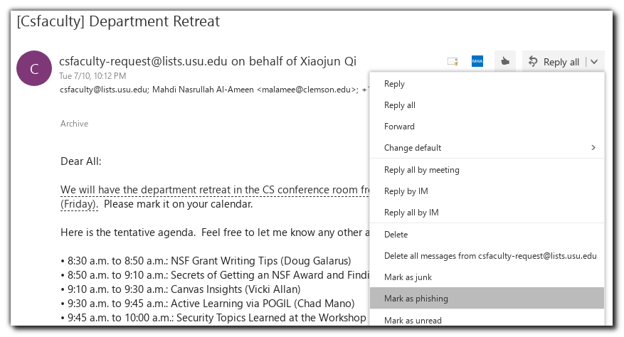
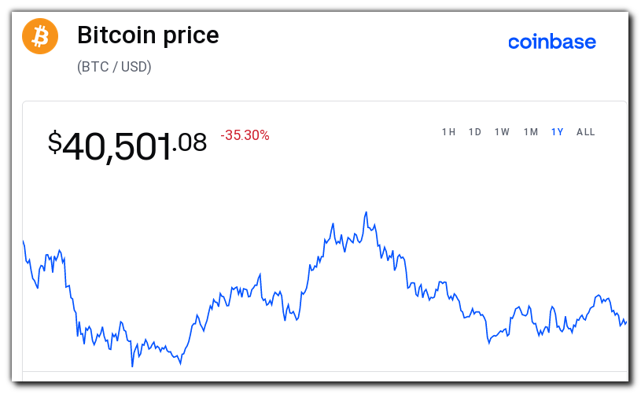
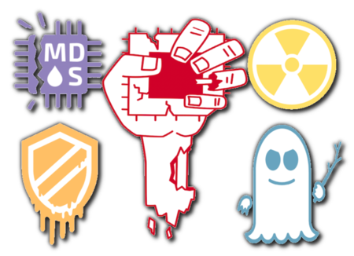
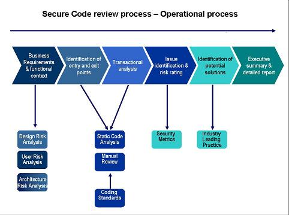
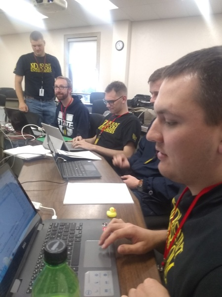
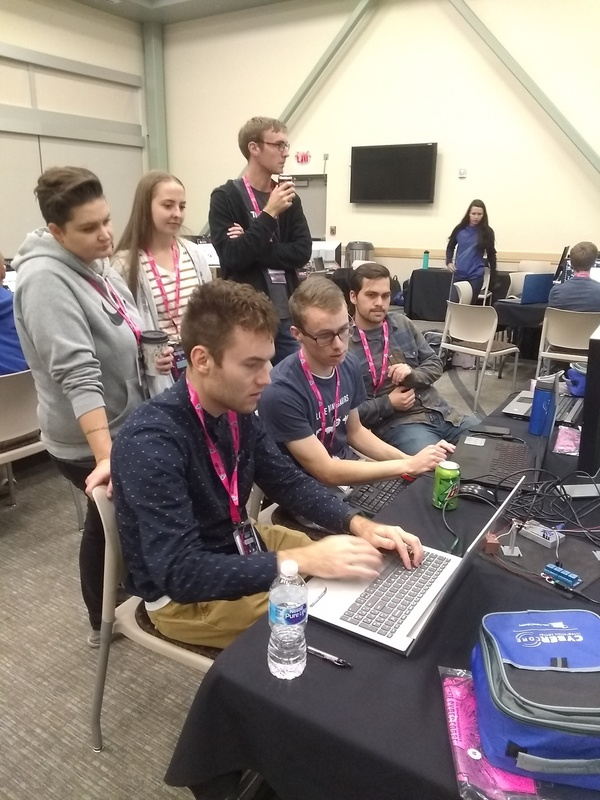
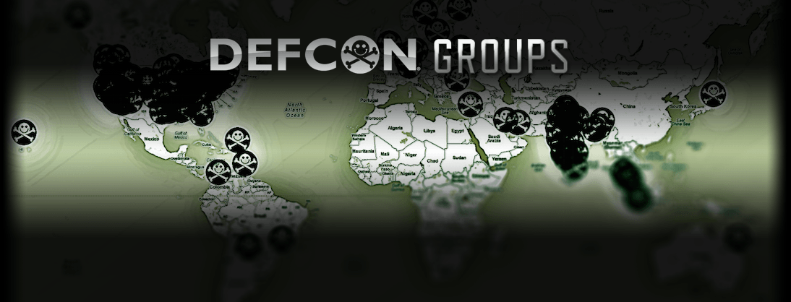

# Cyber Security Threats in `$CURRENT_YEAR`

## Table of Contents

*   [Top Three Threats in `$CURRENT_YEAR`](#top-three-threats-in-current_year)
*   [Hardware](#hardware)
*   [Software](#software)
*   [Humans](#humans)
*   [What USU CS Students Can Do](#what-usu-cs-students-can-do)

## Top Three Threats in `$CURRENT_YEAR`

### 0. Phishing

Be wary of every communication you receive, even if the `From` header indicates it is from a **trusted person**

Our current phishing mitigation techniques are **unsatisfactory**

*   While automated spam filtering continues to improve, it still depends upon **end-users** taking an active role by reporting suspicious messages
    *   This is **reactive** rather than proactive
    *   False positives and false negatives will always occur

Phishing isn't a problem that has a **straightforward technological solution**

### 1. Bad Passwords

How may a password be bad?  Let me count the ways:

0.  Too short or too simple *(defeated by a dictionary or with brute-force)*
1.  Too long or too random *(defeated by user dissatisfaction)*
2.  The same password reused across services *(creates a single point of failure)*

Lists of popular passwords are readily obtainable

Raise your hand if your password is in this table:

| Top 10    | Top 20    | Top 30    | Top 40    | Top 50    |
|-----------|-----------|-----------|-----------|-----------|
|123456     |daniel     |iloveu     |butterfly  |andrea     |
|12345      |babygirl   |000000     |purple     |carlos     |
|123456789  |monkey     |michelle   |angel      |jennifer   |
|password   |lovely     |tigger     |jordan     |joshua     |
|iloveyou   |jessica    |sunshine   |liverpool  |bubbles    |
|princess   |654321     |chocolate  |justin     |1234567890 |
|1234567    |michael    |password1  |loveme     |superman   |
|12345678   |ashley     |soccer     |123123     |hannah     |
|abc123     |qwerty     |anthony    |football   |amanda     |
|nicole     |111111     |friends    |secret     |loveyou    |

### 2. Botnets

*   In previous years, attackers were motivated by a desire for **noteriety** and **lulz**
    *   Attackers left **calling cards** behind as proof of their skill and to mock victims
*   The goal of today's attacker is to **make money**
    *   The last thing they want to do is **draw attention** to the fact that they have pwned your machine
*   An undetected infection may
    *   Steal **sensitive information**
    *   Hold your data for **ransom**
    *   Conscript your device into a botnet and rent **your CPU** to other criminals
        *   **Cryptojacking** is a direct means of monetizing your CPU
*   The relative proportion of ransomware vs. cryptojacking seems to depend upon the price of cryptocurrencies

## Hardware

2018 was the year that gave us so many high-profile hardware attacks, that they started getting cute names and logos:

*   Spectre
*   Meltdown
*   BranchScope
*   TLBleed
*   Intel Management Engine

In 2020 the hits kept coming:

*   RAMBleed
*   CacheOut
*   Intel Converged Security & Management Engine (again)

While there exist **software mitigations** for some of these problems...

*  ...the fixes come at a cost to performance
*  ...not all hardware problems can be patched by software
*  ...they raise troubling concerns about the trustworthiness of our platforms

### Hardware: Supply Chain Weakness

Today, the risk posed by attacks against the **global supply chain** is widely recognized

*   National actors have the **resources** and **motiviation** to infiltrate telecommunications firms that produce
    *   equipment
    *   software
*   and intentionally introduce flaws that they can later exploit

### Hardware: Internet of Things (IoT)

*   IoT devices cut corners around security
    *   no/poor **certificate** management
    *   **default** credentials are commonly-known or leaked on GitHub
    *   too cheap to implement field **updates**
    *   users have **low expectations** of their devices
*   Microsoft recently announced Azure Sphere to combat these challenges
*   If you're not scared yet, check out https://shodan.io
    *   Search your own IP address, you know, just to be sure
*   Attacks against radio frequency channels are becoming more widespread due to the barriers to entry being lowered
    *   Increased **presence** of wireless and RFID technology (Ring doorbells, Bluetooth, WiFi)
    *   Falling costs of **equipment**
    *   Training and learning material readily **available**

## Software

This category should hit close to home for you.  

### Software: [OWASP Top Ten](https://owasp.org/www-project-top-ten/)

*   Vulnerabilities on the Web are a perennial problem
*   The Open Web Application Security Project (OWASP) publishes a periodic Top Ten list of these issues
*   Here is the list for 2021
    1.   Broken Access Control
    2.   Cryptographic Failures
    3.   Injection
    4.   Insecure Design
    5.   Security Misconfiguration
    6.   Vulnerable and Outdated Components
    7.   Identification and Authentication Failures
    8.   Software and Data Integrity Failures
    9.   Security Logging and Monitoring Failures
    10.  Server-Side Request Forgery (SSRF)

### Software: The Cloud

*   We're moving services and platforms into the cloud at an **increasing pace**
*   The questions we must ask are:
    *   What are the **costs** associated with this migration?
    *   How do we **measure** those costs?
    *   What do I **know** about the Hardware/OS of my cloud platform?
    *   Is my cloud provider using **vulnerable** hardware?
    *   Are they **dilligent** about applying necessary updates?
*   As soon as I move my application to the cloud, I **lose the ability** to run my own intrusion detection system, anti-virus, etc.

### Software: Containers

*   A container (Docker, CoreOS, Amazon ECS) is like **Virtual Machine-lite**
*   Containers hold a lot of promise
    *   better **performance** than VMs
    *   flexibility and **ease-of-use**
    *   **reproducability** and consistency
*   But (there's always a but)...
    *   ...containers have poor **tooling** and **defenses**
    *   ...and are therefore **ripe** for abuse

### Software: DevOps

*   Short for "Development" and "Operations"
    *   The aim is to apply principles of **Software Engineering** to problems faced by **System Administrators**
    *   This means that the use of software development **tools** and **practices** have spread into the administration sphere
*   Programmers are being invited to do things which they have neither **experience** nor **training**

### Software: Automation

*   We're increasingly relying on AI to get a grasp on the growing situation brought on by increases in
    *   compute power
    *   storage
    *   bandwidth
    *   number of users
    *   scale of networks
*   Better automation is both a **Blessing** and a **Curse**
    *   **Curse**
        *   Users of **automated fuzzers** win the Pwn2Own competetion
        *   Automation makes a **1:1,000,000** success rate profitable
        *   But the bad guys have this tool, too
    *   **Blessing**
        *   Automated tests in the build process yields **consistent**, **repeatable** results
        *   This makes **detecting** regressions possible

## Humans

*   We're both the **problem** and the **solution** (bet you didn't see this twist coming)
*   **Technologists** like to lean on technology to solve all of our problems
    *   For one thing, technology can **easily** be bought and installed...
    *   ...but its proper **use** is another matter entirely
*   **Education** and **awareness** are the true solutions
    *   The biggest vulnerability in an organization is, and **always has been** the people

### Humans: Social Engineering

*Frank Abignale, Jr., the social engineer whose story was told by the movie "Catch Me If You Can"*

*   Because most people are honest and decent they don't **think like an attacker**, so they aren't credulous enough
    *   Our **biases** and **emotions** can be used against us
    *   This is called **Social Engineering**
*   Technology makes it possible to do the same thing over thousands of miles **without emotion**
*   Breaches happen because of people.  There is no technological solution this problem.  **Education** is the best tool to fight back

## What USU CS Students Can Do

### Practice Secure Development

*   Adopt the **Software Development Life Cycle**
    *   Begin thinking about security from the earliest stages of product design
    *   Break the **security-as-an-afterthought** cycle
    *   Hold **security code reviews**
*   Learn about security best practices for the language and platforms used in your courses

### Think Like a Hacker

*   Social Engineering attacks hinge on people’s innate desires to be **friendly** and **helpful**
*   Software flaws which result in vulnerabilities happen when the developer fails to consider **how this might go wrong**
*   You are **honest** and **decent** people, adversarial thinking doesn't come naturally to you
    *   this is a skill you can and **must** work to acquire
*   Get involved in competitive hacking
    *   USU sends teams to compete in regional Cybersecurity competitions
    *   This could be you!
    *   
    *   
*   Get involved in the local cybersec scene
    *   Attend local security conferences
        *   SAINTCON has scholarships (Fall)
        *   BSidesSLC is nearby and affordable (Winter)
        *   DEF CON is relatively close in Las Vegas (Summer)
    *   Collaborate with peers at nearby schools
        *   Participate in the USU InfoSec club, Capture-the-Flag contests
        *   [DC435](https://dc435.org) holds monthly meetings and is a great way to get a foot in the door

