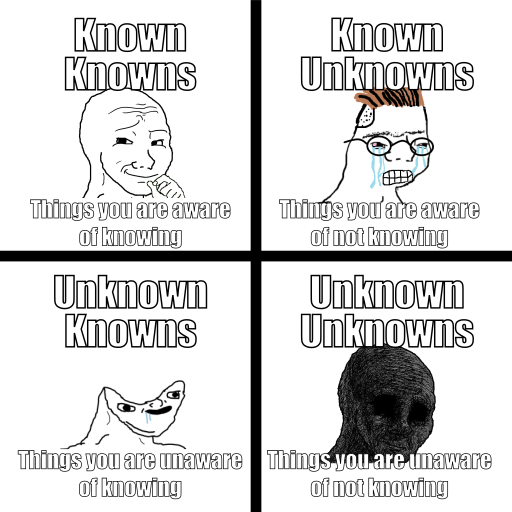

# Software Development Plan

*Adapted from Introduction to Programming using Python by Y. Daniel Liang, section 2.13*

Assignments in this course are larger and more complex than in CS 1400.

You will be given around two weeks per assignment (a.k.a. a *sprint*).  You are given this much time because I sincerely believe that you need all of it.

You should spend more time *designing* your program than *writing* it.  It is perfectly normal to not write a single line of code during the first week of an assignment.  When you focus on designing a good solution before coding it, you encounter fewer bugs and experience less confusion.

This table gives an idea of how you ought to spend your time:

| Project Phase                | Proportion of time
|------------------------------|-------------------
|0. Requirements Specification | 10%
|1. System Analysis            | 10%
|2. Design                     | 30%
|3. Implementation             | 15%
|4. Testing & Debugging        | 30%
|5. Deployment                 | 5%
|6. Maintenance                | N/A

*   In a real world project, the **Phase 6: Maintenance** completely dominates the others; it can last years or decades.
    *   Obviously, you can't experience that in this short time we have together in this class.
*   For best results, apply this advice over the whole two-week sprint.
    *   Do not expect a good outcome if you procrastinate and try to cram this in to one or two days.


## Phase 0: Requirements Specification *(10%)*

**Requirements specification is the process where you come to understand the problem that the software will address, and document in detail what the system needs to do.  This phase involves close interaction between users and developers because problems are not always well defined.**

*   The requirements specification is given to you in the form of the assignment description in the starter code repository.
    *   Think about the problem from the perspective of the end-users of the system.
    *   The TAs and I stand in for the customer when you have questions about what you are required to do.
*   Rewrite the requirements *in your own words*.
    *   Putting it into your own words highlights your "known knowns" and "unknown unknowns".



### Deliverables

*   A detailed written description of the problem this program aims to solve.
*   Describe what a *good* solution looks like.
    *   List what you already know how to do.
    *   Point out any challenges that you can foresee.


## Phase 1: System Analysis *(10%)*

**In this phase identify the input(s) and output(s) and consider how data flows through the system.  The essence of system analysis is input, process, and output (IPO).**

*   As you restate the problem in your own words, identify information that is used by the program and how it will be represented in the programming language.
    *   It helps to first identify what the output should be and then figure out what input results in that output.
    *   Does the program get input from the user?  If so, does it come from interactive prompts, command-line arguments, a file or from the internet?
    *   How is the program's output presented?  Is anything displayed on the screen in as text or graphics?  Are any output files created, and if so, what are they like?
*   Identify any non-trivial formulae you need to create to convert inputs into outputs.

### Deliverables

*   List all of the data that is used by the program, making note of where it comes from.
*   Explain what form the output will take.
*   Describe what algorithms and formulae will be used (but don't write them yet).


## Phase 2: Design *(30%)*

**In the design phase you devise a process for obtaining the output from the input.  Decompose the problem into manageable components, then design each component individually.**

*   Components are formulae and algorithms.  Eventually these will be embodied as *functions* in the finished program.
*   Manually work through several examples that illustrate the program's overall purpose.
    *   Work out examples on paper, on a whiteboard or some other medium that is *not* your computer.
    *   You will converge on the best solution faster if you are comfortable making mistakes.
    *   Mistakes on paper are less devastating than mistakes in code.
    *   Review the assignment rubric and penalties so can avoid doing unnecessary work.
*   Write function signatures that reflect your thinking.
    *   Give functions descriptive names that indicate their purpose.
    *   State briefly, in plain English, what the function's job is.
    *   List what data the function consumes as **input**.
        *   Describe what is *good* and *bad* input for the function, and what will happen in those cases.
        *   These descriptions will become *test cases* in **Phase 4: Testing & Debugging**.
    *   Write a concise explanation of what each function returns as **output**.
    *   Example of a good function signature:
        ```Python
        def isbn13_get_check_digit(isbn):
        """
        Compute the check digit for the first 12 digits of an ISBN-13 number.

        Input: A string of 12 base-10 digits, optionally separated by dashes '-' and/or spaces ' '.
        Output: Return an integer in the range [0-9] for valid input, and 'None' for invalid input.
        """
        ```
*   Describe how functions **process** data by sketching out their bodies in *pseudocode*.
    *   Do not try to write executable code now; you will make many mistakes.
    *   Mistakes are a critical part of your journey; you cannot write a good program without them.
    *   It is easier to throw away bad pseudocode than real code that has flaws.
    *   For this reason you must resist the urge to write *real* Python code now!
    *   Your *pseudocode* will be vague at first; incrementally refine it until it is as specific as *real* code.

### Deliverables

*   Function signatures that include:
    *   Descriptive names.
    *   Parameter lists.
    *   Documentation strings that explain the purpose, inputs and outputs.
*   Pseudocode that captures how each function works.
    *   Pseudocode != source code.  Do not paste your finished source code into this part of the plan.
    *   Explain what happens in the face of good and bad input.
    *   Write a few specific examples that occurred to you.


## Phase 3: Implementation *(15%)*

**Implementation is when you translate your design into a runnable program in a real programming language.**

*   When you are confident in your understanding of how the program will operate you are finally ready to write *real* code.
    *   This is the only part of the software development process where you are focused on writing in a real programming language.
    *   You will know you have arrived when your pseudocode is as detailed as a real program.
*   Copy the pseudocode into your Python file(s).
    *   Function signatures will be easy to convert into proper Python syntax.
    *   Comment out the pseudocode, and add the `pass` statement where needed.
    *   This results in a valid program that runs without errors; at this stage your program doesn't do anything, but neither does it crash.
*   Replace the pseudocode comments with equivalent Python statements.
    *   Watch for the two signs which confirm that you have made a good design:
        0.  Your pseudocode is easily translated into Python.
        1.  This phase is shorter than **Phase 2: Design**.
*   While you are learning a new programming language this phase *will* be slow and difficult.
    *   With experience you will need to spend less time in this phase.

### Deliverables

*   (More or less) working code.
*   Note any relevant and interesting events that happened while you wrote the code.
    *   e.g. things you learned, things that didn't go according to plan


## Phase 4: Testing & Debugging *(30%)*

**Testing ensures that the code meets the requirements specification and weeds out bugs.  In the real-world an independent team of software engineers not involved in the design and implementation of the product usually conducts testing.**

*   Unfortunately, in this course you do not have an independent team of testers.
*   Exercise your program with self-testing, automated testing (later in the semester) and debugging.
*   Ensure that each component if your system are integrated and work well together.
*   Repurpose the good/bad input examples devised in **Phase 2: Design** as tests and ensure that each function passes all of its tests.
    *   You will likely discover mistakes in your design and implementation.
    *   As bugs are discovered and fixed, devise new test cases that will detect these problems should they return.
*   If you didn't come across any bugs (lucky you!) think of a possible flaw and a test that can be employed to screen for it.
*   At a minimum you should create a document which explains, step-by-step, how a non-technical user would manually test your program to satisfy themselves that it operates correctly.
    *   Explain the entire process:
        *   Launching the program.
        *   What inputs are given.
        *   What results should be seen.
*   Provide test cases of *good* and *bad* inputs to catch both *false positives* and *false negatives.* 

### Deliverables

*   A set of test cases that you have personally run on your computer.
    *   Include a description of what happened for each test case.
    *   For any bugs discovered, describe their cause and remedy.
*   Write your test cases in plain language such that a non-coder could run them and replicate your experience.


## Phase 5: Deployment *(5%)*

**Deployment makes the software available for use. Depending on the type of the software, it may be installed on each user’s machine or installed on a server accessible on the Internet.**

*   In this course **deployment** means turning in your work.
    *   Don't leave deployment to the last moment.
    *   Give yourself plenty of time to correct any problems that you may discover.
*   Review the rubric and penalties to make sure that you won't be shocked by your score.  Pay particular attention to:
    *   The naming of your git repository and its URL on the course GitLab server.
    *   The presence of a `.gitignore` file which prevents unwanted files from being committed.
*   **Verify** that your final commit was received by browsing to its project page on GitLab.
    *   Review the project to ensure that all required files are present and in correct locations.
*   **Validate** that your submission is complete and correct by cloning it to a new location on your computer and re-running it.
    *   Run through the test cases to avoid nasty surprises.

### Deliverables

*   Your repository pushed to GitLab.
*   **Verify** that your final commit was received by browsing to its project page on GitLab.
    *   Ensure the project's URL is correct.
    *   Review the project to ensure that all required files are present and in correct locations.
    *   Check that unwanted files have not been included.
    *   Make any final touches to documentation, including this Plan.
*   **Validate** that your submission is complete and correct by cloning it to a new location on your computer and re-running it.
	*	Run your program from the command line (if applicable) so you can see how it will behave when your grader runs it.  **Running it in PyCharm is not good enough!**
    *   Run through your test cases to avoid nasty surprises.
    *   Check that your documentation files are all present.


## Phase 6: Maintenance

**Maintenance is concerned with updating and improving the product. A software product must continue to perform and improve in an ever-evolving environment. This requires periodic upgrades of the product to fix newly discovered bugs and incorporate changes.**

*   Despite the fact that we won't perform this phase of the process in this course, **maintenance** is the most important (and longest) part of the software life cycle.
*   Think about parts of your program that won't stand the test of time.
    *   You know where these are - they're the bits of code that you aren't 100% sure how or why they work.
*   What what maintenance challenges can you foresee in the next:
    *   6 weeks?
    *   6 months?
    *   6 years?
*   After the class is over you can apply the lessons you have learned to:
    *   Address problems discovered by your grader.
    *   Challenge yourself by adding new features that were not part of the original requirements.  Let your creativity run wild!


### Deliverables

*   Write brief and honest answers to these questions: *(Note: do this before you complete **Phase 5: Deployment**)*
    *   What parts of your program are sloppily written and hard to understand?
        *   Are there parts of your program which you aren't quite sure how/why they work?
        *   If a bug is reported in a few months, how long would it take you to find the cause?
    *   Will your documentation make sense to...
        *   ...anybody besides yourself?
        *   ...yourself in six month's time?
    *   How easy will it be to add a new feature to this program in a year?
    *   Will your program continue to work after upgrading...
        *   ...your computer's hardware?
        *   ...the operating system?
        *   ...to the next version of Python or web browser?
*   Fill out the Assignment Reflection on Canvas.
